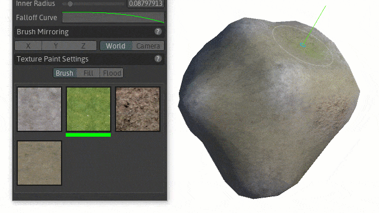
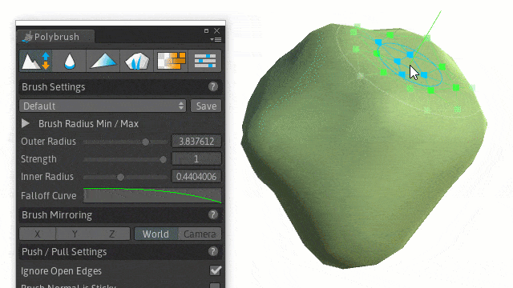
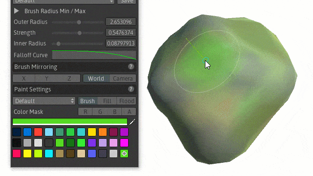
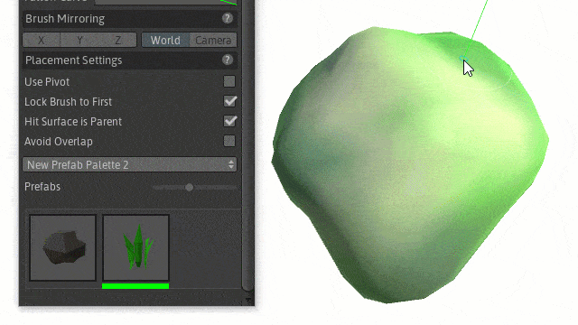
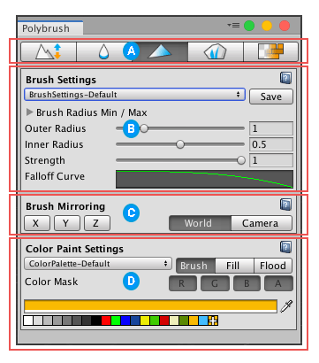
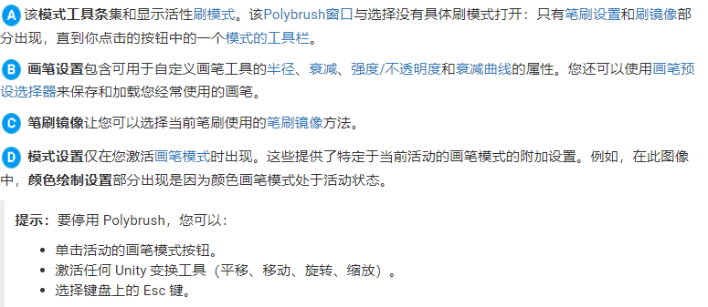
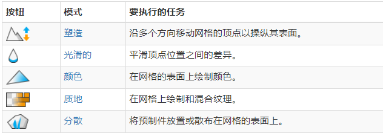

# PolyBrush 简介

> 参考资料：
>
> - [官方文档](https://docs.unity3d.com/Packages/com.unity.polybrush@1.1/manual/index.html)
> - [官方简介](https://unity.com/cn/features/polybrush)
> - [油管教程](https://www.youtube.com/watch?v=JQyntL-Z5bM)

## 1. PolyBrush 简介

Polybrush 可让你直接在 Unity 编辑器中混合纹理和颜色、雕刻网格和分散对象。

核心功能：

- 混合纹理和颜色：  
   纹理绘制模式适合用于纹理混合着色器。Polybrush 包含的一些不同混合材质可帮助你入门：标准纹理混合、TriPlanar 纹理混合和 Unlit 纹理混合。你还可以编写自己的纹理混合着色器。
  

- 雕刻网格：  
   你可以直接在编辑器中雕刻复杂的形状，并使用推/拉工具沿轴向正方向和负方向移动顶点。只需选择任何网格对象，然后单击并拖动，同时将鼠标悬停在选定网格上。根据画笔设置，顶点的实际移动会受到影响。
  

- 绘制顶点颜色：  
   颜色绘制模式可让你使用画笔或颜料桶设置网格的纹理颜色。使用绘制设置下的工具栏可选择两种模式。请注意，顶点颜色模式只有在着色器材质支持顶点颜色时才有效。Polybrush 包括一些支持顶点颜色的默认材质。如果要在网格上绘制颜色，请使用这些材质中的一种。
  

- 分散对象：  
   Polybrush 的最新版本可以让你使用高度可自定义的画笔分散世界中的对象。
  

## 2. 基本用法

### 2.1 工具窗口

从 Unity Editor 菜单中，选择 Tools > Polybrush > Polybrush Window。

### 2.2 画笔模式

Polybrush 提供了五种执行不同任务的画笔模式:

每个模式的具体配置和画笔设置，请直接参考官方文档
