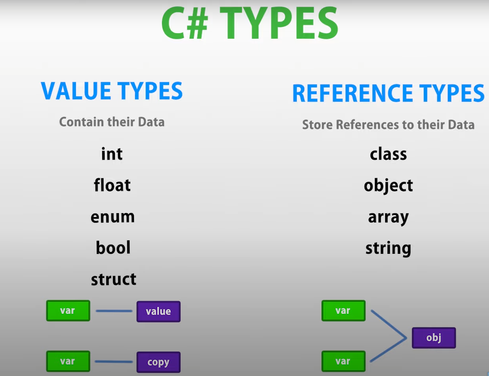

# C# 值类型 Value Type 和引用类型 Reference Type

## 1 概念

值类型中，存储的是它的数值；而引用类型中，存的是指向它真实数据的地址

## 2 分类

- C# 中的值类型有： 基本数据类型、enum、struct
- 引用类型有：class、Object、interface；另外常用的有 array 和 string



## 3 赋值

- 值类型赋值，是 copy。即值的拷贝
- 引用类型赋值，是 引用。传递的是地址

```C#
Student stu1 = new Student("小明",19);
Student stu2 = stu1;
stu1.Age=20;
Debug.Log(stu2.Age);
```

## 4 ref 引用关键字

ref 关键字表示一个值是通过引用传递的。它在四种不同的情况下使用：

- 在方法签名和方法调用中，通过引用将参数传递给方法。
- 在方法签名中，通过引用将值返回给调用者。
- 在成员体中，表示引用返回值存储在本地作为调用者打算修改的引用。或者表示局部变量通过引用访问另一个值。
- 在 struct 声明中，声明 ref struct 或 readonly ref struct。

说白了，就是想要把值类型，按照引用类型的方式来使用时，就可以选择 ref 关键字
