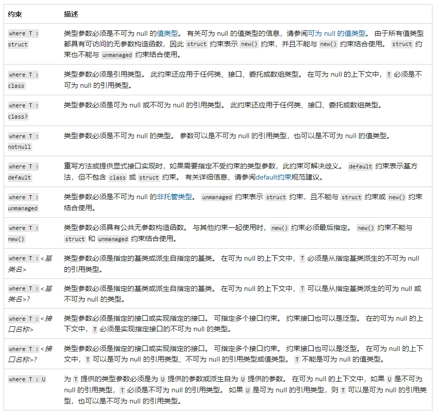

# C#泛型概述

## 1. 概念

对于初学者，建议先学会使用 C# 的集合类，先学会使用系统泛型类，加深理解后，再考虑自定义泛型

### 1.1 基本概念

泛型——泛指的不确定类型。在代码声明并初始化这些类或方法之前，这些类或方法会延迟指定一个或多个类型。 例如，通过使用泛型类型参数 T，代指编写代码时能够使用的单个类（不确定），在具体使用代码时，再把这个泛指的类（T）替换为确切的类，而不会产生运行时转换或装箱操作的成本或风险。

特点：

* 使用泛型类型可以最大限度地重用代码、保护类型安全性以及提高性能。
* 泛型最常见的用途是创建集合类。
* .NET 类库在 System.Collections.Generic 命名空间中包含几个新的泛型集合类。 应尽可能使用泛型集合来代替某些类，如 System.Collections 命名空间中的 ArrayList。
* 可以创建自己的泛型接口、泛型类、泛型方法、泛型事件和泛型委托。
* 可以对泛型类进行约束以访问特定数据类型的方法。
* 在泛型数据类型中所用类型的信息可在运行时通过使用反射来获取。

> 建议：
> 初学者只需要先掌握集合类中泛型的应用即可，进一步可以学习泛型方法。

### 1.2 泛型约束

约束告知编译器类型参数必须具备的功能。 在没有任何约束的情况下，类型参数可以是任何类型。 编译器只能假定 System.Object 的成员，它是任何 .NET 类型的最终基类。 

如果客户端代码使用不满足约束的类型，编译器将发出错误。 通过使用 where 上下文关键字指定约束。 下表列出了各种类型的约束：



## 2. 基本使用

### 2.1 泛型方法

泛型方法就是参数或返回值是泛型类的方法

通过以下系列代码，展示各种泛型方法的定义格式：

``` C#
// 1. 静态泛型方法
// 1.1 定义：
static void Swap<T>(ref T lhs, ref T rhs)
{
    T temp;
    temp = lhs;
    lhs = rhs;
    rhs = temp;
}
// 1.2 静态泛型方法调用：
public static void main()
{
    int a = 1;
    int b = 2;

    Swap<int>(ref a, ref b);
    System.Console.WriteLine(a + " " + b);
}

// 2. 非静态，类对象泛型方法：
// 2.1 定义:
class SampleClass<T>
{
    void Swap(ref T lhs, ref T rhs) {
        T temp;
        temp = lhs;
        lhs = rhs;
        rhs = temp;
    }
}

// 2.2 非静态，类对象泛型方法调用：
public static void main()
{
    int a = 1;
    int b = 2;
    SampleClass<int> s1 = new SampleClass<int>();
    s1.Swap<int>(ref a, ref b);
    System.Console.WriteLine(a + " " + b);
}

// 3. 约束：
// SwapIfGreater<T>，仅可用于实现 IComparable<T> 的类型参数。
void SwapIfGreater<T>(ref T lhs, ref T rhs) where T : System.IComparable<T>
{
    T temp;
    if (lhs.CompareTo(rhs) > 0)
    {
        temp = lhs;
        lhs = rhs;
        rhs = temp;
    }
}
```

### 2.2 泛型类和泛型结构

泛型类和结构创建和使用方法类似，下面以泛型类格式统一介绍

定义时用过得 “T” 称为“占位符”(可以使用任意字母，一般大写)，使用时需要用具体类型(基础数值类型，任意类、接口或结构)替代。

可以有一个或多个，使用时，在类中相同占位符位置只能用相同的类型

``` C#
public struct 泛型结构名<V,T>
{
    public V Field1;
    public T Field2;
}

public class 泛型类名<T>
{
    public T Field;
    .....
}

public static void Main()
{
    泛型类名<string> g = new 泛型类名<string>();
    g.Field = "A string";
}
```

### 2.3 泛型接口

为泛型集合类或表示集合中的项的泛型类定义接口通常很有用处。 为避免对值类型执行装箱和取消装箱操作，最好对泛型类使用泛型接口，例如 IComparable<T>。

接口被指定为类型参数上的约束时，仅可使用实现接口的类型。

如下代码示例演示一个派生自 GenericList<T> 类的 SortedList<T> 类。 

SortedList<T> 添加约束 where T : IComparable<T>。 此约束可使 SortedList<T> 中的 BubbleSort 方法在列表元素上使用泛型 CompareTo 方法。 
 
在此示例中，列表元素是一个实现 IComparable<Person> 的简单类 Person。

``` C#
//Type parameter T in angle brackets.
public class GenericList<T> : System.Collections.Generic.IEnumerable<T>
{
    protected Node head;
    protected Node current = null;

    // Nested class is also generic on T
    protected class Node
    {
        public Node next;
        private T data;  //T as private member datatype

        public Node(T t)  //T used in non-generic constructor
        {
            next = null;
            data = t;
        }

        public Node Next
        {
            get { return next; }
            set { next = value; }
        }

        public T Data  //T as return type of property
        {
            get { return data; }
            set { data = value; }
        }
    }

    public GenericList()  //constructor
    {
        head = null;
    }

    public void AddHead(T t)  //T as method parameter type
    {
        Node n = new Node(t);
        n.Next = head;
        head = n;
    }

    // Implementation of the iterator
    public System.Collections.Generic.IEnumerator<T> GetEnumerator()
    {
        Node current = head;
        while (current != null)
        {
            yield return current.Data;
            current = current.Next;
        }
    }

    // IEnumerable<T> inherits from IEnumerable, therefore this class
    // must implement both the generic and non-generic versions of
    // GetEnumerator. In most cases, the non-generic method can
    // simply call the generic method.
    System.Collections.IEnumerator System.Collections.IEnumerable.GetEnumerator()
    {
        return GetEnumerator();
    }
}

public class SortedList<T> : GenericList<T> where T : System.IComparable<T>
{
    // A simple, unoptimized sort algorithm that
    // orders list elements from lowest to highest:

    public void BubbleSort()
    {
        if (null == head || null == head.Next)
        {
            return;
        }
        bool swapped;

        do
        {
            Node previous = null;
            Node current = head;
            swapped = false;

            while (current.next != null)
            {
                //  Because we need to call this method, the SortedList
                //  class is constrained on IComparable<T>
                if (current.Data.CompareTo(current.next.Data) > 0)
                {
                    Node tmp = current.next;
                    current.next = current.next.next;
                    tmp.next = current;

                    if (previous == null)
                    {
                        head = tmp;
                    }
                    else
                    {
                        previous.next = tmp;
                    }
                    previous = tmp;
                    swapped = true;
                }
                else
                {
                    previous = current;
                    current = current.next;
                }
            }
        } while (swapped);
    }
}

// A simple class that implements IComparable<T> using itself as the
// type argument. This is a common design pattern in objects that
// are stored in generic lists.
public class Person : System.IComparable<Person>
{
    string name;
    int age;

    public Person(string s, int i)
    {
        name = s;
        age = i;
    }

    // This will cause list elements to be sorted on age values.
    public int CompareTo(Person p)
    {
        return age - p.age;
    }

    public override string ToString()
    {
        return name + ":" + age;
    }

    // Must implement Equals.
    public bool Equals(Person p)
    {
        return (this.age == p.age);
    }
}

public class Program
{
    public static void Main()
    {
        //Declare and instantiate a new generic SortedList class.
        //Person is the type argument.
        SortedList<Person> list = new SortedList<Person>();

        //Create name and age values to initialize Person objects.
        string[] names =
        [
            "Franscoise",
            "Bill",
            "Li",
            "Sandra",
            "Gunnar",
            "Alok",
            "Hiroyuki",
            "Maria",
            "Alessandro",
            "Raul"
        ];

        int[] ages = [45, 19, 28, 23, 18, 9, 108, 72, 30, 35];

        //Populate the list.
        for (int x = 0; x < 10; x++)
        {
            list.AddHead(new Person(names[x], ages[x]));
        }

        //Print out unsorted list.
        foreach (Person p in list)
        {
            System.Console.WriteLine(p.ToString());
        }
        System.Console.WriteLine("Done with unsorted list");

        //Sort the list.
        list.BubbleSort();

        //Print out sorted list.
        foreach (Person p in list)
        {
            System.Console.WriteLine(p.ToString());
        }
        System.Console.WriteLine("Done with sorted list");
    }
}
```

### 2.4 泛型事件、委托

委托可以定义它自己的类型参数。 引用泛型委托的代码可以指定类型参数以创建封闭式构造类型，就像实例化泛型类或调用泛型方法一样，如以下示例中所示：

``` C#
public delegate void Del<T>(T item);
public static void Notify(int i) { }

Del<int> m1 = new Del<int>(Notify);
```

引用委托的代码必须指定包含类的类型参数.

``` C#
private static void DoWork(float[] items) { }

public static void TestStack()
{
    Stack<float> s = new Stack<float>();
    Stack<float>.StackDelegate d = DoWork;
}
```

根据典型设计模式定义事件时，泛型委托特别有用，因为发件人参数可以为强类型，无需在它和 Object 之间强制转换。

``` C#
delegate void StackEventHandler<T, U>(T sender, U eventArgs);

class Stack<T>
{
    public class StackEventArgs : System.EventArgs { }
    public event StackEventHandler<Stack<T>, StackEventArgs>? StackEvent;

    protected virtual void OnStackChanged(StackEventArgs a)
    {
        if (StackEvent is not null)
            StackEvent(this, a);
    }
}

class SampleClass
{
    public void HandleStackChange<T>(Stack<T> stack, Stack<T>.StackEventArgs args) { }
}

public static void Test()
{
    Stack<double> s = new Stack<double>();
    SampleClass o = new SampleClass();
    s.StackEvent += o.HandleStackChange;
}
```

<br>
<hr>
<br>

>参考资料
>* [微软官方文档](https://learn.microsoft.com/zh-cn/dotnet/csharp/programming-guide/generics/constraints-on-type-parameters)