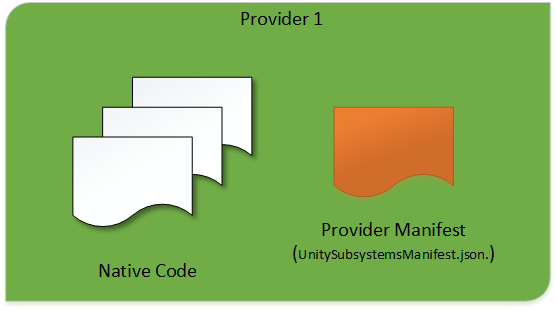
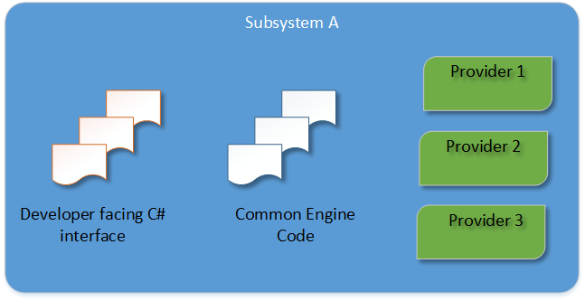

# Unity XR Tech Stack 技术栈

## 1. 概念

Unity通过其插件框架和一套功能和工具包来支持XR开发。

在项目设置中，转到 XR Plug-in Management，以启用Unity项目中的XR支持，并选择项目支持的XR平台的插件。

使用Unity包管理器安装额外的功能包。

## 2. 架构图

下图说明了当前Unity XR Plug-in Framework 框架结构以及它如何与平台提供者实现一起工作。


从下到上，依次为：

### 2.1 Provider Implementations 提供商实现

各 XR 厂商根据 Unity XR SDK 规定的标准接口（API），来制作的用来与 Unity XR SDK 对接的驱动程序包

比如 ：VR 的有 Oculus XR Plugin 、Pico Interaction SDK 等；AR 的有 Google ARCore XR Plugin、Apple ARKit XR Plugin

有了这些驱动，用 Unity 打包后的应用，才能正常运行在对应厂商的系统上，并完美驱动该厂商对应的硬件

如果从开发角度上来看，这些提供者是UnityXR子系统的在本机上的实现



提供程序符合Unity 原生插件接口，并在其之上构建了一些额外的生命周期支持。入口点是UnityPluginLoad方法。从那里，提供者必须向其打算实现的所有子系统注册。


``` C#
extern "C" void UNITY_INTERFACE_EXPORT UNITY_INTERFACE_API
UnityPluginLoad(IUnityInterfaces* unityInterfaces)
{
    s_XrDisplay = unityInterfaces->Get<IUnityXRDisplayInterface>();
    UnityLifecycleProvider displayLifecycleHandler =
    {
        NULL, // This can be any object you want to be passed as userData to the following functions
        &Lifecycle_Initialize,
        &Lifecycle_Start,
        &Lifecycle_Stop,
        &Lifecycle_Shutdown
    };

    // 注册 Display 子系统
    s_XrDisplay->RegisterLifecycleProvider("Provider Plugin Name", "Display0", &displayLifecycleHandler);

    // 接下来再注册其他需要的子系统...
}
```

当完成导入底层动态库，和子系统的注册之后，就可以在运行时中，添加对子系统的发现和激活：

``` C#
using System;
using System.Collections;
using System.Collections.Generic;
using UnityEngine;
using UnityEngine.Experimental.XR;
using UnityEngine.XR;

public class Display : MonoBehaviour
{
    public string match = "Display0";

    // Use this for initialization
    void Start ()
    {
        List<XRDisplaySubsystemDescriptor> displays = new List<XRDisplaySubsystemDescriptor>();
        SubsystemManager.GetSubsystemDescriptors(displays);
        Debug.Log("Number of display providers found: " + displays.Count);

        foreach (var d in displays)
        {
            Debug.Log("Scanning display id: " + d.id);

            if (d.id.Contains(match))
            {
                Debug.Log("Creating display " + d.id);
                XRDisplaySubsystem dispInst = d.Create();

                if (dispInst != null)
                {
                    Debug.Log("Starting display " + d.id);
                    dispInst.Start();
                }
            }
        }
    }
}

```

接下来，就是普通开发者在Unity编译器中，通过 XR Plugin Manager，来配置运行时对子系统的加载了。

如果你希望自己的厂商出现在 XR Plugin Manager 的UI 中，需要编写一个 XRLoader

### 2.2 XR Plugin framework

XR 插件框架，包含两部分，一部分是用来提供标准驱动接口的 Unity XR SDK，还有一部分是提供具体 XR 各部分功能的 Subsystems XR 子系统

### 2.2.1 Unity XR SDK

普通 XR 应用开发者用不到这个，这是提供给 XR 系统或硬件厂商的 Unity XR 通用系统接口开发包。

它规定了针对 Unity XR 功能实现，统一的接口规则。

不同 XR 厂商的系统或硬件，只要按照 Unity XR SDK 中设定好的统一规则实现了通用接口，就可以将他们各自系统、硬件中的数据，顺利传输给 Unity XR 系统，驱动各个功能子系统


### 2.2.2 Unity XR Subsystems

Unity 使用子系统接口，通过 SDK 与不同平台的提供程序进行通信，为应用程序的 XR 功能提供动力。有了这些接口，您就可以在所有具有该功能提供程序的 XR 设备上重复使用应用程序中的相同功能代码。

定义了 XR 功能的通用接口。XR插件实现这些子系统接口以在运行时向子系统提供数据。您的 XR 应用程序可以通过 Unity 引擎和包 API 访问 XR 功能的数据。

简单来说，XR SubSystem 包含了实现各种实际功能的通用接口，我们的 Unity XR 应用，在使用这些接口时，代码只需要书写一次，就可以发布到不同厂商的设备上

如面的系统结构图所示，XR 子系统现阶段包含十个，分别负责不同的功能模块：

* Display 显示：XR 中的显示相关功能模块，包括 文本显示定位的UI、帧生命周期和节奏阻塞的接口
* Input 输入：实现跟踪和控制器输入，将硬件获取的用户输入数据，传输给Unity引擎，也可以将反馈回送给硬件设备，比如震动信息
* Meshing 网格：为环境扫描生成的3D网格系统，将厂商系统中传输过来的 Mesh Data（网格数据）转换成 UnityEngine.Mesh;它还可以生成可选的UnityEngine.MeshCollider，而不会导致任何主线程停顿;网格生成在后台线程上异步发生，因此从外部提供程序提取数据不会阻塞主线程，网格的大小或更新频率没有限制。例如烘焙网格对撞机;网格划分子系统的主要用例,是表面处理程序生成网格，通常来自空间映射算法，似于从深度算法相机生成
* Environment 环境：XR 场景构建
* Faces : 玩家面部跟踪、处理
* Raycast ：射线系统
* Camera ：摄影机系统
* Planes ： 平面系统
* Image Tracking：2D 图片识别、跟踪，通常用于 AR
* Object Tracking：3D 物体识别、跟踪，通常用于 AR

单个子系统结构图如下：



单个子系统通常包括：

* 面向开发人员的 C# 接口（向上）
* 多个后端（Provider）通过动态库实现的本机接口
* 处理与 C# 接口、本机接口和引擎其余部分通信的通用引擎代码

### 2.3 Developer Tools 开发者工具

### 2.3.1 XR Interaction Toolkit 

XR 交互工具包

### 2.3.2 AR Foundation

AR 基础包

### 2.3.3 MARS

Mixed and Augmented Reality Studio 混合和虚拟现实开发者工具（工作室）很贵、付费，不多做介绍，感兴趣的可以直接去 Unity 官网看：[https://unity.com/products/unity-mars](https://unity.com/products/unity-mars1)


<br>
<hr>
<br>

> 参考资料：
>
> * [Unity 官方文档](https://docs.unity3d.com/Manual/)