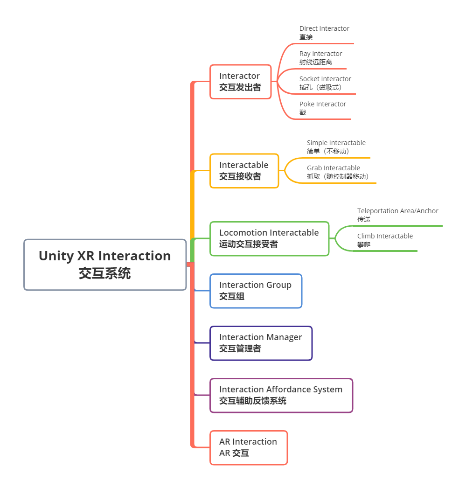

# XR Interaction System —— Unity XR 交互系统

## 1. 概念

Interaction System 是 Unity XRI 中的核心系统，用于实现将控制输入转换成交互操作的核心功能。

核心组件主要分为三组：

### 1.1 XR Interaction Manager 交互管理者： 

* Interactor 和 Interactable 之间的中介机构，实现二者间的通信。启用后，交互器和可交互项都会向一个有效的交互管理器注册。
* 加载的场景必须至少有一个交互管理器，这样交互器和交互对象才能进行通信。
* 如果Interactor 和 Interactable 中的 Interaction Manager 属性没有设置，Unity 会自动在当前场景中找到一个添加上，如果 Interaction Manager 有多个的话，必须指定。 允许多个交互管理器，管理各自的交互者和交互对象
* 交互器和交互对象上的许多方法都是由交互管理器调用的，而不是直接调用，以便保持交互事件两个目标之间的一致性。

所以说，虽然配置最简单，但 XR Interaction Manager 组件是整个交互系统中功能最重要的组件

### XR Interaction Manager 工作步骤

* 接收并监听 Interactor 和 Interactable 以及 Interactor Group 的注册和注销；并且可以挂接响应注册、注销事件的自定义操作
* 监听 Interactor 和 Interactable 的输入控制操作状态，有输入操作时，在二者之间传递消息。比如，Interaction Manager 每帧都会检测 Interactor 当前的 hover或select状态，并为所有Interactor生成目前 hover 和 select 的有效 Interactable 列表，同时通知 Interactor 和 Interactable 处理各自的事件方法；
* 每帧 检测所有的 Interactor 和 Interactor 所挂接 Interactable ，看他们之间是否还存在交互，如果没有的话，将无效对象清除

### 1.2 Interactor 

交互器，用于发出交互动作，通常和输入控制器 XR Controller 放到同一个游戏对象上，构建出 VR 的控制输入对象的完整功能

### 1.3 Interactable

交互对象，用于接收交互动作，作出响应。所以，一般要挂接到需要操作的对象上，比如武器、物品、机关等

### 1.4 类图

### 1.5 三种状态（三个操作）

在 02 XRI 介绍中，已经提到过这三种类型 VR 操作对应的三种状态，在此再强调一次

* Hover 悬停：  
  Interactor Ray 射线或 Collider 和 Interactable 碰撞时，处于 Hover 状态。不需要控制器按键，只需要控制器处于特定位置，使碰撞（射线碰撞或碰撞体碰撞）生效

* Select 选择：  
  通常发生在 Hover 前提之下，可以由 Hover 转换为 Select ，通常绑定的是控制器的 Grip 键。  
  当 Grip 键被按下，即 GripPressed 时触发。

* Activate 激活：  
  通常发生在 Select 前提之下，由 Select 转为 Activate ，通常绑定的是控制器的 Trigger 键。  
   当 Trigger 键被按下，即 TriggerPressed 时触发

三种状态，会对应 Interactor 和 Interactable 中的相应事件，每个状态对应两个或更多。在 Interactable 上，Interaction Event 两两成对，一个是 Entered ，一个是 Existed，对应状态的开始和结束；在 Interactor 上，Interaction Event 通常3个成一组，除了 Entered 和 Existed 外，还会多一个 Canceled 取消事件。

## 2. Interaction System 组件

见下图：

## 3. Interactor 交互器

### 3.1 交互器组件通用属性

### Selection 配置

* Interaction Manager   
  交互管理器，连接交互器和交互对象的桥梁，所有交互操作都通过这里发出

* Interaction Layer Mask  
  设置专属的交互层，来对不同类型的交互分割开，同一层的交互层的 Interactor 和 Interactable 才能交互，不同层互不影响。注意，这个和普通的 Layer 无关

* Attach Transform  
  用作交互器和交互对象连接点位置设置，比如握枪的位置
  
* Disable Visuals When Blocked In Group  
  当该互动者是互动组的一部分，并且由于组内另一个互动者的积极互动而无法进行互动时，是否禁用视觉效果。

* Select Action Trigger  
  选择 Unity 如何解释来自控制器的选择输入操作。推荐使用默认选项 State Change  
    * State ：只要select 操作对应的按键处于激活状态，Unity 会认为输入处于活动状态。用户可以在可以进行交互之前按住按钮，但在可以进行交互时仍会触发交互。如果多个交互者选择了设置为 InteractableSelectMode.Single 的可交互对象，则可能会出现不希望出现的行为，即在每一帧中，可交互对象的选择在交互者之间来回传递。这也会导致每帧都触发选择交互事件。
    * State change：只有在按下按钮的那一帧，Unity 才会认为该输入处于激活状态，用户必须在可以进行交互时按下按钮才能触发交互。如果用户在可以进行交互之前就开始按下按钮，则不会触发交互。
    * Toggle：按下进入激活状态，直到第二次按键才能取消，比如玩家抓取一个物体后，不想一直按着 grip 键就能保持 selected 状态，就可以设定为这个选项
    * Sticky：按下进入激活状态，直到第二次按键松开才能取消

* Keep Selected Target Valid  
  在最初选择一个交互对象后，即使该对象不再是有效目标，是否仍要继续选择该对象。通常，在抓取操作时，设置为 true；在 传送操作时，设置位 false

* Hide Controller On Select  
   当前的 Interactor 在 处于选中状态时，是否隐藏控制器模型。设置位 TRUE 可以简化项目，省去手部动画

* Allow Hovered Activate  
  当前的 Interactor 在 Hovered 状态但是，没有处于 Selected 状态时，是否要发送 activate 和 deactivate 事件给 Interactable 对象。默认是只有处于 Selected 状态时，Interactor 才允许发送activate 和 deactivate 事件给 Interactable 对象。 

* Target Priority Mode  
  交互目标的优先模式，设定要监控的目标个数  
  * None： 不监控，选择这个模式时，Interactor 的 targetsForSelection 属性（Interactable 按优先级排序而成的 列表）不会被更新，消耗最低
  * HighestPriorityOnly：只监控优先级最高的目标，targetForSelection 列表将只更新优先级最高的目标，如果当前帧中没有可选择的目标，则该列表将为空。该选项的性能代价适中。
  * All：跟踪所有目标，targetForSelection 列表将更新为当前帧中可选择的所有交互对象。该选项的性能代价较高。

* Stating Selected Interactable  
  起始选中的交互对象 

### Interactor Filters 配置

目标过滤器用于扩展交互器如何优先处理和过滤可与之交互的交互对象的逻辑。

说白了，Interactor Filters 就是除了 Interaction Layer 交互层之外，更精细的一种交互操作是否响应、优先跟谁交互的筛选逻辑的实现方式。

> Interactor 负责创建一个列表（称为 "Valid Target list 有效目标列表"），其中包含它在一帧中有可能 Hover或 Select 中的那些 Interactables 交互对象。有效目标列表按优先级排序，默认情况下，距离最近的交互对象优先级最高。

> 每个 Interactable 可互动目标都可以有不同的距离计算方法，这可能会影响其在有效目标列表中的排序。

按距离对有效目标列表进行排序的默认标准可通过目标过滤器进行扩展或覆盖。这通常是通过 XRTargetFilter 组件完成的。

XRTargetFilter 组件是一个高度可配置的组件，用于过滤有效目标列表中的交互对象。它使用其评估器对象计算出的分数对该列表进行排序。

* Starting Target Filter ：设置过滤器
* Starting Hover Filters ：只针对 Hover 动作设置过滤器
* Staring Select Filters ：只针对 Select 动作设置过滤器

### XR unity events配置

* Audio Events  
  设置 unity XR Interacation 事件绑定播放指定音频  
  * AudioClip To Play : 挂接需要播放的声音片段文件

* Haptic Events  
   设置 unity XR Interacation 事件绑定控制器震动反馈  
   * Haptic Intensity: 震动强度
   * Duration：震动时长

* Interactor Events  
     设置 unity XR Interacation 事件绑定任意自定义的方法，一个事件可以同时挂接多个方法

### 3.2 Direct Interactor 直接交互器

需要直接触碰到交互对象的交互器，通过碰撞体实现交互的触发，所以必须给此交互器组件配套一个碰撞体。

尽可能不要用 Mesh Collider，容易出Bug，且性能不佳，通常添加碰撞体的经验如下：

* 手型交互器：附加 一个 0.1 单位大小 Sphere Collider 球状碰撞体
* 控制器模型交互器：附加一个 Box Collider

### Direct Interactor 特定属性

* Improve Accuracy With Sphere Collider  
  每帧使用优化的球状碰撞体来生成触点，而不是依赖固定更新上（FixedUpdate）的触点事件。禁用可强制使用触发事件(Trigger Event)。

### 3.3 Ray Iteractor 射线（间接）交互器

### 3.4 Socket Interactor 插孔（磁吸式）交互器

### 3.5 Poke Interactor 戳（手指）交互器

## 4. Interactable 交互对象

交互对象必须同时再挂接碰撞体和刚体才能真正实现交互

碰撞体尽量用形状接近的集合碰撞体，Mesh 碰撞体比较吃性能，而且容易出 Bug（如果模型有瑕疵的话）

### 4.1 交互对象组件通用属性

* Interaction Manager   
  交互管理器，连接交互器和交互对象的桥梁，所有交互操作都通过这里发出

* Interaction Layer Mask  
  设置专属的交互层，来对不同类型的交互分割开，同一层的交互层的 Interactor 和 Interactable 才能交互，不同层互不影响。注意，这个和普通的 Layer 无关

* Colliders：   
  碰撞体。用来跟 Interactor 中碰撞体碰撞的组件，是实现交互的基础。碰撞体碰撞后，才会引发 Hover 状态的产生。如果当前游戏对象上有碰撞体，可以不填留空，Unity 会自动绑定

* Distance Calculation Mode

* Custom Reticle

* Select Mode

* Focus Mode

* Gaze Configuration  
  是否允许瞳孔跟踪交互

* Interactable Filters

* Interactable Events

### 4.2 Simple Interactable 简单交互对象

不能被拿起来，它的所有属性，Grab Interactable 里都有。

但存在的就是合理的，既然叫 Simple “简单”，功能上弱但性能上自然就更优。

可以用在一些固定不动的交互物体上

### 4.3 Grab Interactable 抓取交互对象

### 4.4 Locomotion 系统中的交互对象

* 传送用：Teleportation Area/Anchor
* 攀爬用：Climb Interactable
  