# URP Material surface 材质表面设置

## 1. 光

当光与任何物体接触时，它可以做以下三件事之一：

- 反射：从物体反射回来，这称为反射，包含镜面反射和漫反射；
- 透射：穿过它，如果物体是透明的或半透明的，其中包括被折射的光；
- 被吸收：光被物体吸收。

下图是一般的 PBR 中处理 普通电介质（木头、石头、塑料）的光照模式

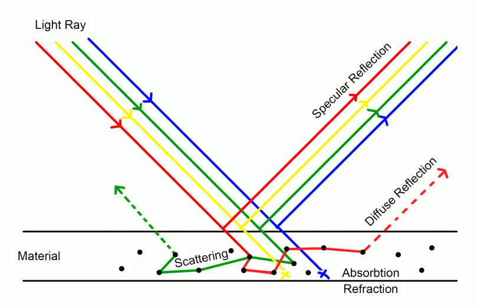

物体在人眼看来的方式取决于它以这些方式的某种组合对光的反应。

## 2. 镜面反射（Specular reflection）和漫反射（diffuse reflection）

### 2.1 基本概念

光从物体反射有两种方式：镜面反射和漫反射。

### Specular reflection 镜面反射

镜面反射是指光直接的反射，射入和反射光的量相等，物体最明亮的部分通常都是镜面反射。

在下面的示例图像中，镜面反射是白色的，这表明光源是白色的。

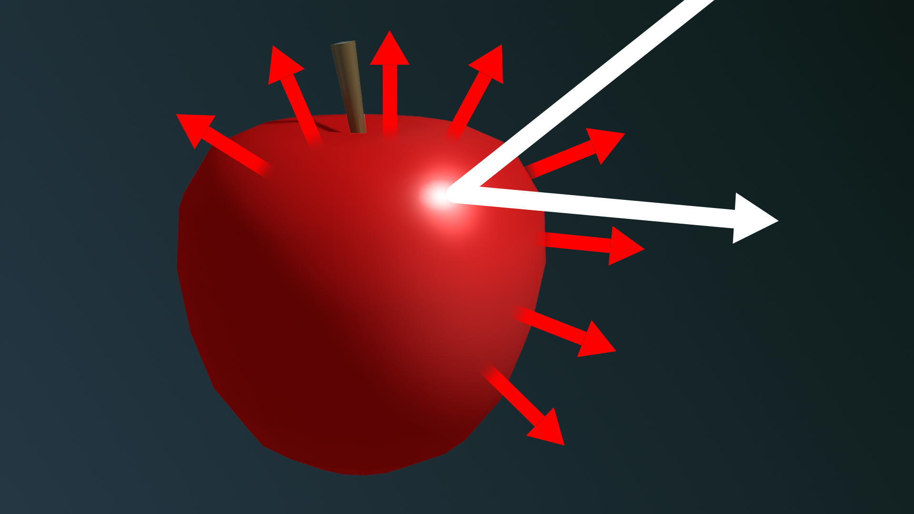

### Diffuse reflection 漫反射

但并非所有到达苹果的光都直接从它反射回来。其他光线穿透表面，穿过或在苹果的外层周围反射。这种光有的被吸收，有的被反射出去。逸出的光是漫反射。

上面的图中，红色部分的光就是漫反射的光线

物体的漫反射决定了它的可见颜色。在苹果上，非红光被吸收，红光反射到我们的眼睛。

总之，镜面反射和漫反射构成了表面的总反射率。所有反射光要么是镜面的，要么是漫反射的。

### 2.2 Unity 中实体表面光处理设置原则

Unity 中，影响一个物体表面反射光线的属性设置主要有两个：

1. Smoothness 光滑度：
   很容易理解，就是描述物体表面光滑程度的计量属性。在 Unity 中通过数值来设定。
2. specularity 镜面反射度：
   高光不同于平滑度。我们可以把一个红苹果打磨到非常光滑，但它永远不会变成金属。然而，为了有任何镜面反射，一个光滑的物体必须有一些镜面反射。  
   下图中的苹果具有相同的平滑度，但增加了高光度
   
   specularity 在 Unity 中并不直接用数值设定，而是使用纹理贴图来设定

所以，必须有 specularity > 0，才能使物体表面产生镜面反射，否则，即使光滑度最高，也只有漫反射

Unity 中，设置物体表面质感，有两种不同的工作流流程：

- 金属模式 Metallic：反射光和入射光颜色相同
- 高光模式 Specular: 可以随意设置反射光的颜色，可以跟入射光色彩不同

### 2.3 使用 高光（镜面反射）工作流程设置表面质感

在 Specular 工作流程中，Specular 设置大于 0 的平滑材质会有一些镜面反射。

在高光工作流程中，遵循以下设置原则：

- 有光泽的金属具有高镜面反射设置和高平滑度设置。
- 有光泽的非金属具有低镜面反射设置和高平滑度设置。
- Smoothness 聚焦镜面反射，Specular Map 控制镜面反射的量和颜色。
- 高光贴图可以使用 RGB 颜色。

### 2.4 使用 金属 工作流程设置表面质感

Specular 工作流程是两者中更科学的。Metallic 工作流程更简单，但并不严格遵循物理光的规则。

在金属工作流程中，遵循以下设置原则：

- 闪亮的金属具有高金属设置和高平滑度设置。
- 闪亮的非金属具有零或低金属值和高平滑度值。
- 平滑度控制镜面反射的焦点。
- 金属贴图仅使用灰度。

> 两种工作流的比对：
> 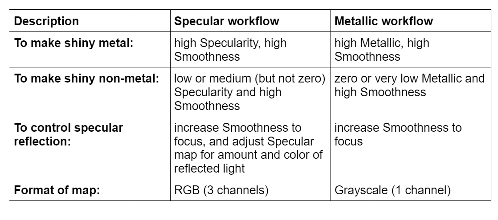

### 2.5 Unity 中物体表面设置效果比对图

金属设置参考图表

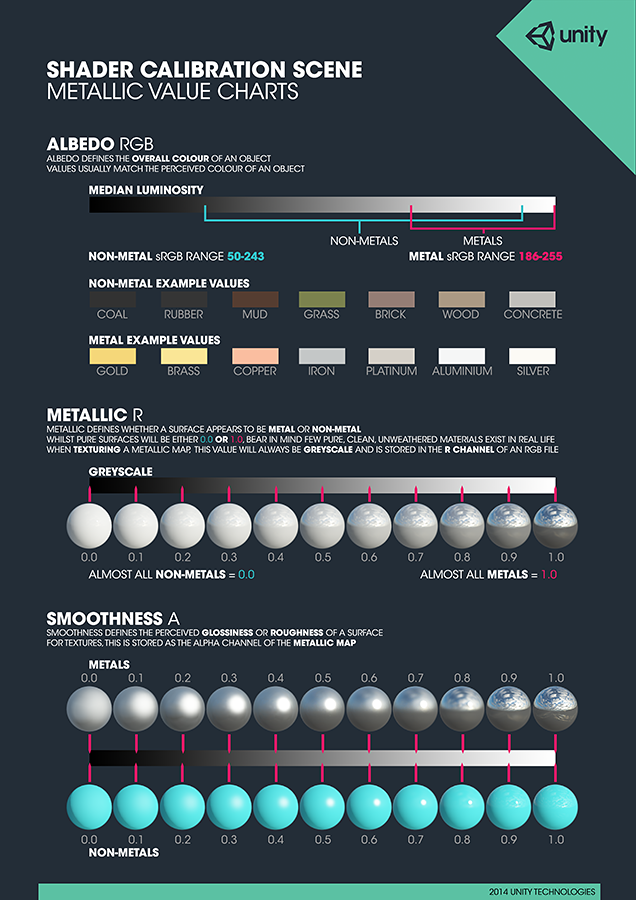

高光设置的参考图表

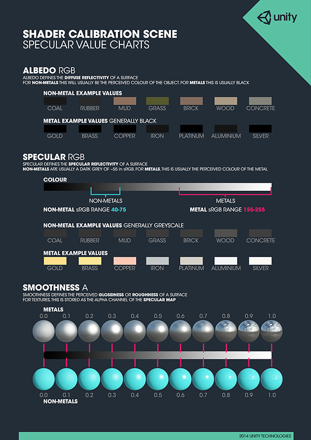

## 3. URP Shader/lit Material surface Options

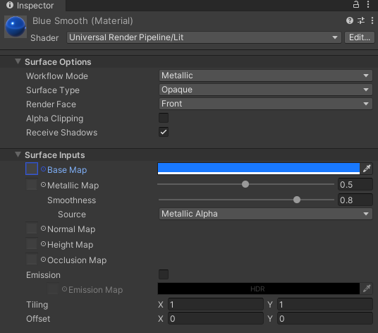

### 3.1 Workflow Mode 工作流模式：

使用此下拉菜单选择适合自己的物体表面纹理的工作流程:

- 金属模式 Metallic：反射光和入射光颜色相同
- 高光模式 Specular: 可以随意设置反射光的颜色，可以跟入射光色彩不同

在 Surface Options 表面属性中，将 WorkFlow Mode 工作流模式设置为不同值，会影响到下面 Surface Inputs 表面输入值 中的属性布局：

1. Metallic 模式：  
   
2. Specular 模式：
   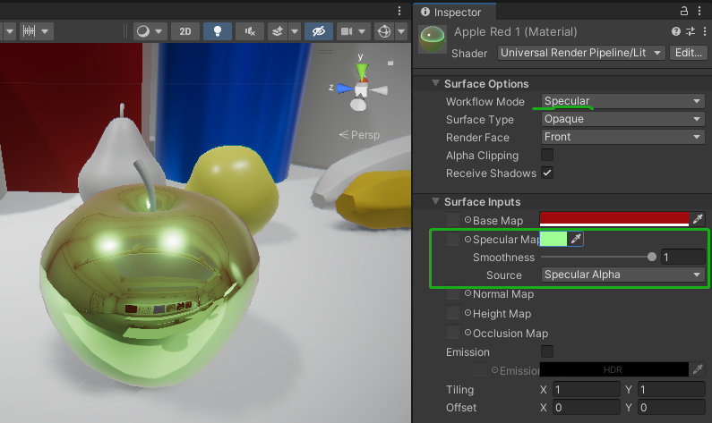

### 3.2 Surface Type 表面类型

使用此下拉菜单将不透明或透明表面类型应用于材质。这决定了 URP 在哪个渲染过程中渲染材质。

1. Opaque 不透明:不透明表面类型始终是完全可见的，无论它们背后是什么。URP 首先渲染不透明材质。
2. Transparent 透明：透明表面类型受其背景影响，它们会根据您选择的透明表面类型而有所不同。URP 在不透明对象之后在单独的通道中渲染透明材质。如果您选择透明，则会出现混合模式下拉菜单 Blending Mode。

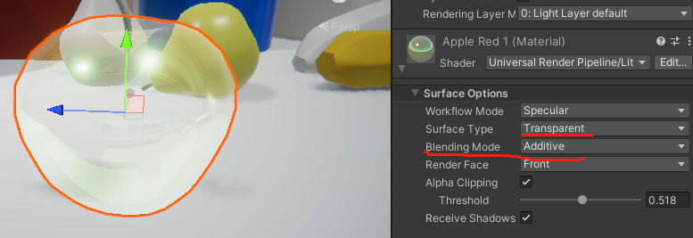

### 3.3 Blending Mode 混合模式

只有 Surface Type 选择 Transparent 后，才会出现此属性选项

使用此下拉菜单来确定 URP 如何通过将材质与背景像素混合来计算透明材质的每个像素的颜色。

1. Alpha : 使用材质的 alpha 值来更改对象的透明度。0 是完全透明的。1 看起来完全不透明，但在透明渲染过程中仍会渲染材质。用于可见但也会随着时间的推移而消失的视觉效果非常有用，例如云。
2. Premultiply 自左乘: 将与 Alpha 类似的效果应用于材质，但保留反射和高光，即使您的表面是透明的。这意味着只有反射光是可见的。例如，透明玻璃。
3. additive 叠加: 在另一个表面的顶部为材质添加一个额外的层。这对全息图有好处。
4. Multiply 乘法: 将材质的颜色与表面后面的颜色相乘。这会产生更暗的效果，就像你透过彩色玻璃看一样。

### 3.4 Render Face 渲染面

使用此下拉菜单来确定要渲染几何体的哪一侧。

1. Front：渲染几何体的正面，并剔除背面。这是默认设置。
2. Back ：背面渲染几何体的正面并剔除正面。
3. Both： 两者都使 URP 渲染几何体的两个面。这对两边都可见的小而扁平的物体（如树叶）很有用。

### 3.5 Alpha Clipping 透明度裁剪

使用它在不透明区域和透明区域之间创建具有硬边的透明效果。

例如，创建草叶。为实现此效果，URP 不会渲染低于指定 Threshold 的 alpha 值，当您启用 Alpha Clipping 时会出现该值。您可以通过移动滑块来设置阈值，该滑块接受从 0 到 1 的值。高于阈值的所有值都是完全不透明的，低于阈值的所有值都是不可见的。例如，阈值 0.1 意味着 URP 不会呈现低于 0.1 的 alpha 值。默认值为 0.5。

### 3.6 Receive Shadows 接收阴影

勾选此框以使您的游戏对象能够被其他对象投射到其上。如果取消选中此框，则游戏对象上不会有阴影。

## 4. Diffuse reflectivity 漫反射率

### 漫反射率 Diffuse reflectivity = 漫反射光 / 入射光

漫反射的光除以射到物体表面的可见光得出的比例。

### albedo 反照率 = 反射光 / 入射光

反射光 = 镜面反射光 + 漫反射光

所以，一般来说，除了在一些特殊的理想表面（完全漫反射，没有镜面反射），albedo 大于且包含 Diffuse reflectivity

albedo 从表面反射回的入射光的比例。

## 5. URP Shader/lit Material surface Inputs

### 5.1 Base Map（基础贴图、基础映射、漫反射贴图）：

前面说过，漫反射光决定了物体的颜色。所以，在 Unity 的 URP/Lit Shader 中，使用 Base Map 来设定 漫反射率，即物体表面的颜色或贴图用纹理。

在其他 Shader 中，类似的属性有 Albedo 或 Diffuse Map

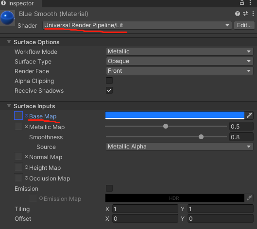

- 纹理可以拖拽到左边方框，或使用圆点（对象选择器）从资源文件中选择；
- 右侧是颜色选择器

如果在 Surface Options 下选择透明或 Alpha Clipping，材质将使用纹理的 Alpha 通道或颜色。

### 5.2 Metallic / Specular Map 金属/高光 贴图

- Metallic Map : 对应 Metallic 工作流模式  
   使用滑块控制表面的金属感。1 是全金属的，如银或铜，0 是全电介质，如塑料或木材。对于脏污或腐蚀的金属，您通常可以使用介于 0 和 1 之间的值。  
   左侧也可以分配金属感使用的贴图纹理
- Specular Map：对应 Specular 工作流模式  
   您可以通过单击旁边的对象选择器为其分配纹理。这将打开资产浏览器，您可以在其中从项目中的纹理中进行选择。或者，您可以使用颜色选择器.
- Smoothness 平滑度：  
   对于这两种工作流程，您都可以使用“平滑度”滑块来控制表面上高光的分布。0 给出一个宽阔、粗糙的高光。1 提供像玻璃一样的小而锐利的高光。介于两者之间的值会产生半光泽外观。例如，0.5 会产生类似塑料的光泽度。
- Source ：
  使用 Source 下拉菜单选择着色器从何处采样平滑度贴图。

  - Metallic Alpha（来自金属贴图的 Alpha 通道）
  - Albedo Alpha（来自基本贴图的 Alpha 通道）。

  默认值为金属 Alpha。如果所选源具有 Alpha 通道，则着色器对通道进行采样并将每个采样乘以平滑度。

### 5.3 Normal Map 法线贴图

法线贴图 (Normal Map) 是一种凹凸贴图 (Bump Map)。通过设置法线贴图，可以添加表面细节，如凹凸、划痕和凹槽。从而捕捉光线，就像由真实几何体表示一样。

法线贴图拾取环境中的环境光照。

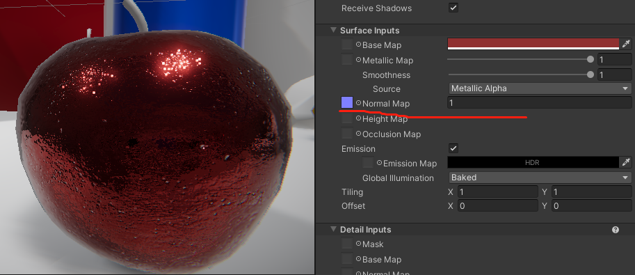

设置旁边的浮点值是 法线贴图效果的乘数。低值会降低法线贴图的效果。高值会产生更强的效果。
好处是，使用 2D 资源模拟出 3D 表面细节效果，大幅度节省机器性能

例如，您可能希望显示一个表面，在表面上有凹槽和螺钉或铆钉，比如飞机机身。为实现此目的，一种方法是将这些细节建模为几何体。如下所示，细节建模飞机金属板为真实几何体。

根据具体情况，将这些微小的细节建模为“真实”几何体通常并非一种好的思路。在右侧，您可以看到构成单个螺丝头的细节所需的多边形。在具有大量精细表面细节的大型模型上，这种方案需要绘制极大数量的多边形。为了避免这种情况，我们应使用法线贴图来表示精细的表面细节，而使用分辨率较低的多边形表面来表示模型的较大形状。

如果我们改用凹凸贴图来表示此细节，则表面几何体可以变得简单得多，并且细节将通过纹理呈现，用纹理来调节表面如何反射光。现代图形硬件可以非常快速地完成此过程。现在，金属表面可变为一个简单多边形平面，而螺钉、铆钉、凹槽和划痕将捕捉光线，并会因为纹理而显得有深度。

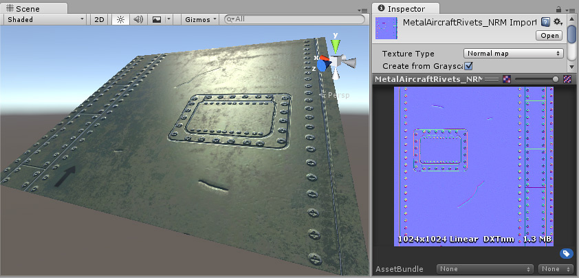

上图中，在法线贴图中定义了螺钉、凹槽和划痕，此贴图将修改从这个简单多边形平面的表面反射光线的方式，给人以 3D 细节的印象。除了铆钉和螺钉外，纹理还可以让我们包含大量其他细节，如细微的凹凸和划痕。

在现代游戏开发的美术制作流程中，美术师将使用他们的 3D 建模应用程序基于超高分辨率的源模型生成法线贴图。然后将法线贴图映射到可直接用于游戏的较低分辨率的模型版本，从而使用法线贴图渲染原始的高分辨率细节。

扩展阅读：[官方文档：法线贴图](https://docs.unity3d.com/cn/2020.3/Manual/StandardShaderMaterialParameterNormalMap.html)

### 5.4 Height Map 高度贴图

URP 实现了视差映射技术，该技术使用高度贴图通过移动可见表面纹理的区域来实现表面级遮挡效果。

它类似于法线映射的概念，但是这种技术更复杂，因此性能也更昂贵。

高度贴图通常与法线贴图一起使用，通常它们用于想给表面定义一个很大的凹凸效果使用。

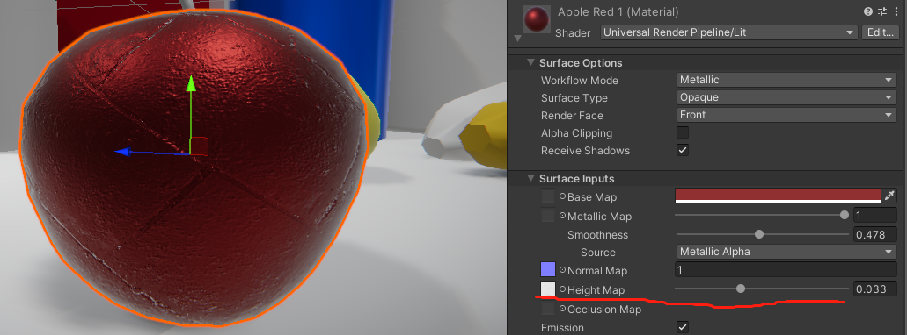

设置旁边的浮点值是高度图效果的乘数。低值会降低高度贴图的效果。高值会产生更强的效果。

这种效果，它可以产生一个非常令人信服的 3D 几何效果，表面的凹凸效果有些会相互遮挡住，看起来真的像是 3D 几何体，但真实的几何体没有任何修改，因为这仅仅是绘制一个表面的效果。

高度贴图正常应该是张灰度图，白色代表凸起的部分，黑色代表凹下的部分。下面就是 Albedo 贴图和高度贴图的匹配使用。

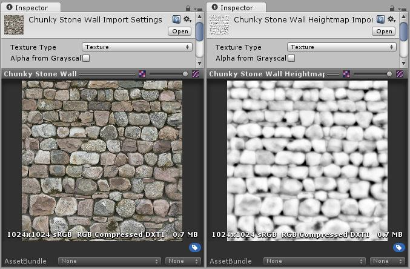

下图从左向右说明：

1. 岩石墙材质只设置了 Albedo 贴图，没有设置法线贴图和高度贴图。
2. 设置了法线贴图。修改了表面的光照，但岩石间没有相互遮挡效果。
3. 这个精致的效果是使用了法线贴图和高度贴图。岩石看起来就像是从表面凸起来似的，靠近相机的岩石看起来可以遮挡着后面的岩石。

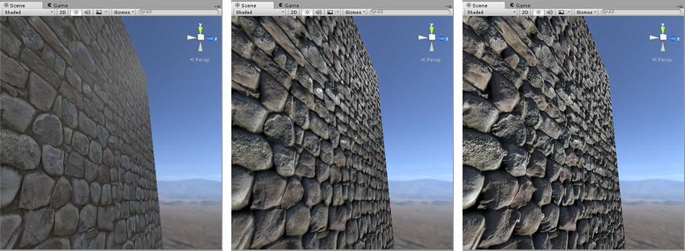

### 5.5 Occlusion Map 遮挡贴图

遮挡贴图用于模拟来自环境光和反射的阴影，这使得照明看起来更逼真，因为更少的光到达物体的角落和缝隙

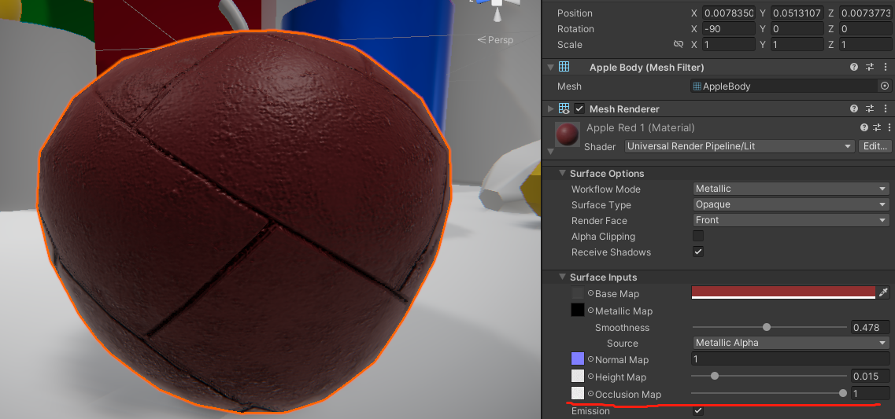

用于提升模型间接光影效果。间接光源可能来自 Ambient Lighting（环境光），因此模型中凹凸很明显的凹下去那部分，如裂缝或褶皱，实际上不会接收到太多的间接光。

一张遮挡贴图应该就是张灰度图，白色代表应该接收到的间接光效果会多一些，黑色代表少一些（全黑说明一点间接光都不接收）。

生成遮挡纹理稍微更复杂一些。例如，在场景中有个角色戴了一帽子，在帽子和角色的头之间会有些边缘是几乎接收不到间接光的。在这种情况，这种遮挡贴图通常是由美术同学使用 3D 软件根据模型自动生成的。

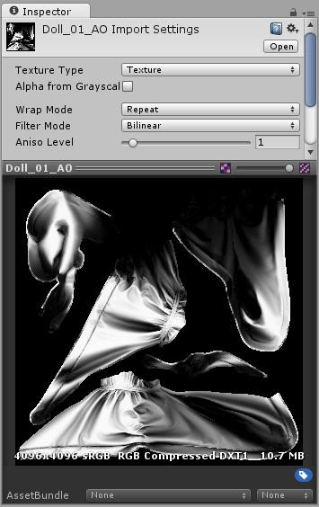

遮挡贴图定义了角色的头戴的披肩附近的部分，哪些相对 Ambient lighting（环境光）是曝光，哪些是挡光的。如下图显示。

在应用遮挡贴图前后的效果图（左边没使用，右边使用了）。部分模型的区域被遮挡了，特别是在脖子周围的头戴饰品遮挡的那部分，左边的图片显示太亮了，右边的图片设置了环境光遮挡贴图后的效果，脖子那些绿色的、来自环境草木的环境光就没那么亮了。

### 5.6 Emssion 散发（光）

使表面看起来像是在发光。启用后， 会出现 Emission Map 和 Emission Color 设置。

- Emission Map 发光贴图
- Emission Color 发光颜色

属性设置：

1. Color : 指定发光的颜色和强度。单击 Color 框可打开 HDR Color 拾色器。在此处可以更改光照的颜色和发光的强度 (Intensity)。要指定材质的哪些区域发光，可以向该属性分配一个发光贴图。如果您执行此操作，Unity 会使用贴图的全色值来控制发光颜色和亮度。还可以使用 HDR 拾色器对贴图着色和改变发光强度。
2. Global Illumination : 指定此材质发出的光如何影响附近其他游戏对象的环境光照。有三个选项：
   - Realtime：Unity 将此材质的自发光添加到场景的 Realtime Global Illumination（实时全局光照）计算中。这意味着此自发光会影响附近游戏对象（包括正在移动的游戏对象）的光照。
   - Baked：Unity 将此材质的自发光烘焙到场景的静态全局光照中。此材质会影响附近静态游戏对象的光照，但不会影响动态游戏对象的光照。但是，光照探针仍然会影响动态游戏对象的光照。
   - None：此材质的自发光不会影响场景中的实时光照贴图、烘焙光照贴图或光照探针。此自发光不会照亮或影响其他游戏对象。材质本身具有发光颜色。

发光贴图示例：

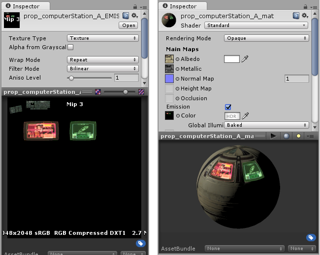

上图，左：计算机终端的发光贴图。此处有两个发光屏幕以及键盘上的发光按键。右：使用发光贴图的发光材质。该材质同时具有发光和非发光区域。

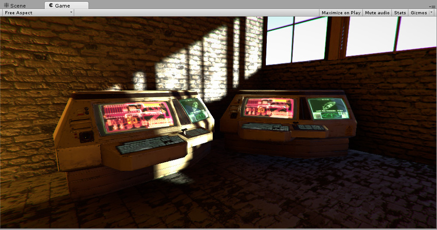

在上图中，存在高亮度和低亮度的区域，并有阴影投射在发光区域上，这充分表现了发光材质在不同光照条件下的显示效果。

上图中可以看出，计算机终端发光贴图中的烘焙发光值会照亮此黑暗场景中的周围区域

### 5.7 Tilling 平铺

根据 U 轴和 V 轴缩放纹理以适应网格的 2D 乘数值。这适用于地板和墙壁等表面。默认值为 1，表示不缩放。设置更高的值以使纹理在您的网格中重复。设置较低的值以拉伸纹理。

### 5.8 Offset 偏移量

将纹理定位在网格上的 2D 偏移。

## 6. Detail Inputs

使用 Detail Inputs 设置向表面添加额外的细节。

要求：GPU 支持着色器模型 2.5 或更高版本。

1. Mask 蒙版：  
   选择一个纹理，定义 Unity 将细节贴图覆盖在表面输入贴图上的区域。蒙版使用选定纹理的 Alpha 通道。平铺和偏移设置对蒙版没有影响。
2. Base Map 基础贴图：  
   Unity 使用叠加模式将此地图与 Surface Base Map 混合。
3. Normal Map 法线贴图：  
   选择包含法线矢量数据的纹理。用一个法线贴图添加表面细节，如凹凸、划痕和凹槽。

   使用设置旁边的滑块更改地图效果的强度。默认值为 1。

Tilling 和 Offset 跟上面的功能相同

## 7. Advanced 高级设置

高级设置会影响渲染的基础计算。它们对的表面效果没有明显的影响。

1. Specular Highlights 镜面高光：  
   启用此选项可让您的材质具有来自直接照明的镜面高光，例如 定向灯、点灯和聚光灯. 这意味着您的材质会反射来自这些光源的光芒。禁用它以忽略这些高光计算，因此您的着色器渲染速度更快。默认情况下，此功能已启用。
2. Environment Reflections 环境光反射：  
   使用最近的采样反射反射探头, 或者，如果您在灯光窗口照明探头. 如果禁用此选项，您将进行更少的着色器计算，但这也意味着您的表面没有反射。
3. Sorting Priority 排序优化：  
   使用此滑块确定材质的时间渲染顺序。URP 首先渲染具有较低值的材质。您可以使用它来减少设备上的过度绘制，方法是让管道首先在其他材质之前渲染材质，因此它不必渲染重叠区域两次。这与渲染队列 在内置的 Unity 渲染管道中。
4. Enable GPU instancing 启用 GPU 实例化：  
   尽可能在批处理中使用相同的几何图形和材质渲染 URP 网格。这使得渲染更快。如果网格具有不同的材质或硬件不支持 GPU 实例化，URP 无法使用批处理渲染网格。

> 参考资料：
>
> - [官方教程-模拟固体表面](https://learn.unity.com/tutorial/simulate-solid-surfaces)
> - [URP 官方文档-着色器和材质](https://docs.unity3d.com/Packages/com.unity.render-pipelines.universal@12.1/manual/shaders-in-universalrp.html)
> - [官方文档-材质参数](https://docs.unity3d.com/cn/2020.3/Manual/StandardShaderMaterialParameters.html)
> - [Material physics in context of PBR texturing](https://handlespixels.wordpress.com/2018/03/23/material-physics-in-context-of-texturing/)
> - [Height Map 高度贴图](http://www.noobyard.com/article/p-mthigxse-pb.html)
> - [ Occlusion Map 遮挡贴图](http://www.noobyard.com/article/p-ulvnjlzv-pb.html)
> - [灰度图、高度图和法线贴图 介绍及原理](https://blog.csdn.net/Game_jqd/article/details/82056157)
