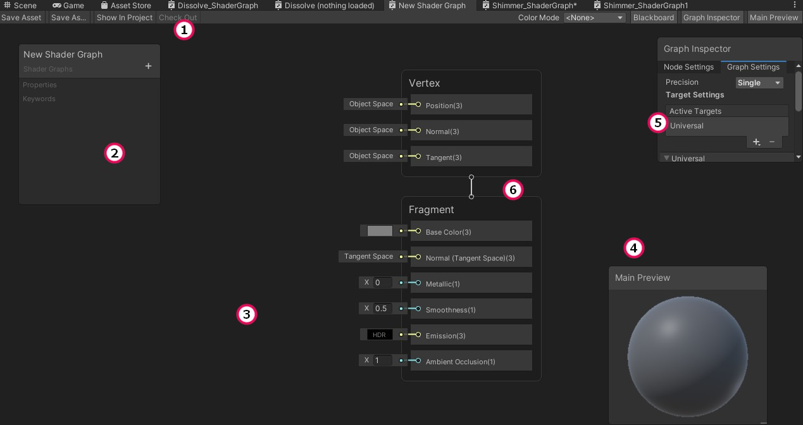
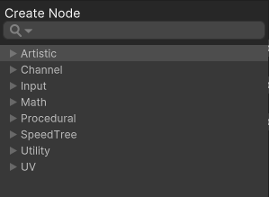
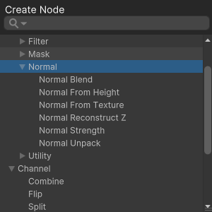

# Shader Graph 简介

> 建议：
>
> 对 Shader 概念不太清楚的同学，先回顾一下前面的 [03-Shader 着色器](https://gitee.com/chutianshu1981/AwesomeUnityTutorial/blob/main/%E5%9B%BE%E5%BD%A2-%E6%8A%80%E6%9C%AF%E7%BE%8E%E5%B7%A5%E7%9B%B8%E5%85%B3/03-Shader%E7%9D%80%E8%89%B2%E5%99%A8.md) 这一节文档。

## 1. 什么是 Shader Graph

Shader Graph 就是图形化 Shader 编程工具。类似于 Blender 中的 Shader Editor

Shader Graph 可以帮助您使用类似流程图的图形来构建着色器。在创建图表时，您可以实时查看着色器的材质效果，这让您可以轻松进行实验。

Shader Graph 能够让您直观地构建着色器。您可以在图形框架中创建并连接节点，而不必手写代码。

使用 Shader Graph 可以极大地降低 Shader 开发的难度，对于没有 Shader 编程开发经验的初学者，以及非程序员非常友好。

下图中使用了 Shader Graph 创建的着色器，请看效果：

> 注意：
>
> - 内置渲染管线虽不允许对渲染管线进行编程，但可以在图形层中，使用自定义的 Shader 着色器，着色器可以进行自定义开发（直接用代码，或 使用 shader graph ）。
> - 自定义的渲染管线，不支持 Shader Graph

## 2. 获取 Shader Graph

着色器图可通过 Unity 编辑器支持版本中的包管理器窗口获得。

如果您安装 Scriptable Render Pipeline (SRP)，例如 Universal Render Pipeline (URP)或 High Definition Render Pipeline (HDRP)，Unity 会自动在您的项目中安装 Shader Graph。

Unity Engine 2018.x 上的 Shader Graph 包版本为预览版，不接受错误修复和功能维护。要使用受积极支持的 Shader Graph 版本，请使用 Unity Engine 2019.1 或更高版本。

## 3. 创建 Shader Graph

右键单击 Project 窗口，在上下文菜单中找到 Create > Shader Graph，然后选择所需的 Shader Graph 类型。

下图是 URP 项目中创建 Shader Graph 的截图：

可用的 Shader Graph 类型取决于项目中存在的渲染管道。根据渲染管道，某些选项可能存在也可能不存在。所以如果到了 HDRP 项目中，肯定和上面截图中不同，不会有 URP 选项，而是换成 HDRP。

不过，以下选项始终可用：

- Blank Shader Graph：一个完全空白的着色器图。没有选择目标，也没有块被添加到主堆栈。
- Sub Graph: 一个空白的子图资产。

## 4. Shader Graph 界面

### 4.1 Shader Graph 窗口

- Shader Graph 工具栏 (1): 是您保存着色器资源的地方。

* Blackboard 黑板(2): 包含可供使用此着色器创建材质所使用的属性。可以在此处对图表中的属性和关键字进行定义、排序和分类。在 Blackboard 中，您还可以编辑所选 Shader Graph Asset 或 Sub Graph 的路径。
* 工作区 (3): 将在其中创建着色器的节点图。
* Main Preview 主预览窗口 (4): 将为您提供着色器外观及其行为方式的实时更新。
* Graph Inspector 图形检查器窗口 (5): 将显示您选择的任何节点的当前设置、属性和值。
* Master Stack 主堆栈 (6): 是定义着色器最终表面外观的着色器图的终点，一个 Shader 中有且只有一个。它列出了顶点着色器和片段着色器的主要着色器属性，并为您提供了插入必要值的末端节点。
* Internal Inspector：包含与用户当前单击的任何内容相关的信息的区域。这是一个默认情况下自动隐藏的窗口，只有在选择了用户可以编辑的内容时才会出现。使用内部检查器显示和修改属性、节点选项和图形设置。

### 4.2 Shader Graph 窗口操作方式

- 平移：单击鼠标中键并拖动，或按住 Alt (Windows) 或 Option (macOS) 并单击并拖动。
- 缩放：旋转滚轮或使用触控板缩放。
- 聚焦和放大：选择一个元素并按 F 键。
- 适合窗口：按 A 键。
- 空格键：创建节点，打开创建节点菜单

## 5. 使用 Shader Graph 编辑 Shader 通用步骤

虽然不同的 Shader ，需要使用不同的编写方式，但在使用 Shader Graph 编辑 Shader，大体上都会遵循下面的步骤：

1. 创建一个新节点：
2. 连接节点：
3. 配置节点，更改节点输出
4. 保存图表
5. 创建材质，选择编辑好的 Shader，并挂接到游戏对象，这一步，也可以放到第二步，这样可以随时在 Unity 中观察 Shader 在游戏对象上的效果

## 6. Node 节点

### 6.1 节点概述

Shader Graph 中和新元素是 Node 节点，每种节点功能各不相同。

每个节点都包含多个端口 Port，每个端口都有确定的数据类型，这些 Port 端口可以用来输入（在节点左侧）、输出（在节点右侧）。

通过 边 Edge 可以将节点连接起来，组成完整的 Shader Graph。

只有一个 Edge 可以连接到任何输入端口，但多个 Edge 可以连接到输出端口。

### 6.2 节点分类

不同版本 Shader Graph 中，包含的节点种类不同，在最新的 2022.1 版本的 Unity 中，对应的 Shader Graph 为 14.0.0，其中已经包含了近百种不同类型的 Node 。

在 Shader 编辑器中，按照 Create Node 菜单，将其分为八大类，大类中还有子类的细分

在此无法一一细说，就像类库中的类一样，用到时再讲

 

 

> 参考资料：
>
> - [官方文档-着色器](https://docs.unity3d.com/cn/current/Manual/Shaders.html)
> - [创意核心教程-初学 ShaderGraph](https://learn.unity.com/tutorial/get-started-with-shader-graph)
> - [Shader Graph 官方文档](https://docs.unity3d.com/Packages/com.unity.shadergraph@14.0/manual/index.html)

配套视频教程：
[https://space.bilibili.com/43644141/channel/seriesdetail?sid=299912](https://space.bilibili.com/43644141/channel/seriesdetail?sid=299912)

文章也同时同步微信公众号，喜欢使用手机观看文章的可以关注

