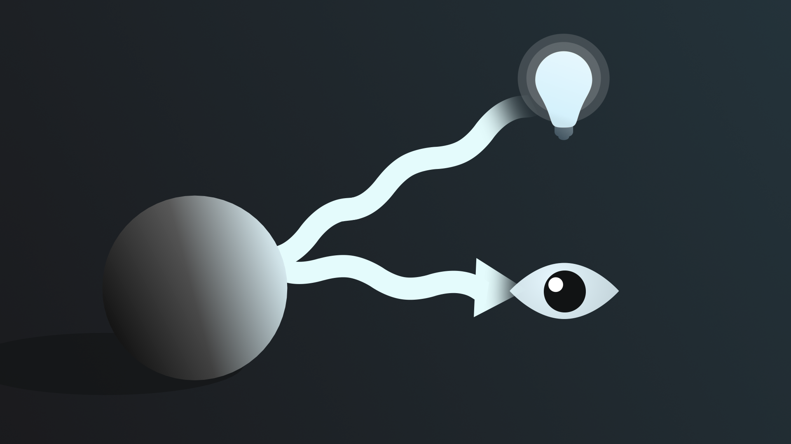

# lighting 光照简介

## 1. Unity 光照概念

### 1.1 光照在游戏中的作用

一句话：提升游戏体验和视觉效果

Unity 中光照的工作方式类似于光在现实世界中的情况。Unity 使用详细的光线工作模型来获得更逼真的结果，并使用简化模型来获得更具风格化的结果。

### 1.2 物理概念

#### 1.2.1 直射

光源直接到眼睛

#### 1.2.2 反射

反射时我们能看到不发光物体的原因

* 镜面反射：当光波撞击非常光滑的表面并产生镜像时，完全反射
* 非镜面反射：当光波撞击一个不光滑的表面时，一些能量被吸收，其余的被反射回各种不同的方向（散射）

#### 1.2.3 折射

当光波穿过空气以外的物体（如水或玻璃）时，它的路径会因此而改变。

## 2. unity 中的光源

发光物体就是光源

### 2.1 光源的三个核心属性

* Shape ： 形状影响光发射的方向 direction
* size : 大小影响光照面积 area
* strength / intensity ：强度影响光传播的远近，以及亮度 

> 参考资料：
> 
> * [lighting unity 官方文档](https://docs.unity3d.com/cn/2022.1/Manual/LightingOverview.html)

 

 

配套视频教程：
[https://space.bilibili.com/43644141/channel/seriesdetail?sid=299912](https://space.bilibili.com/43644141/channel/seriesdetail?sid=299912)

文章也同时同步微信公众号，喜欢使用手机观看文章的可以关注

