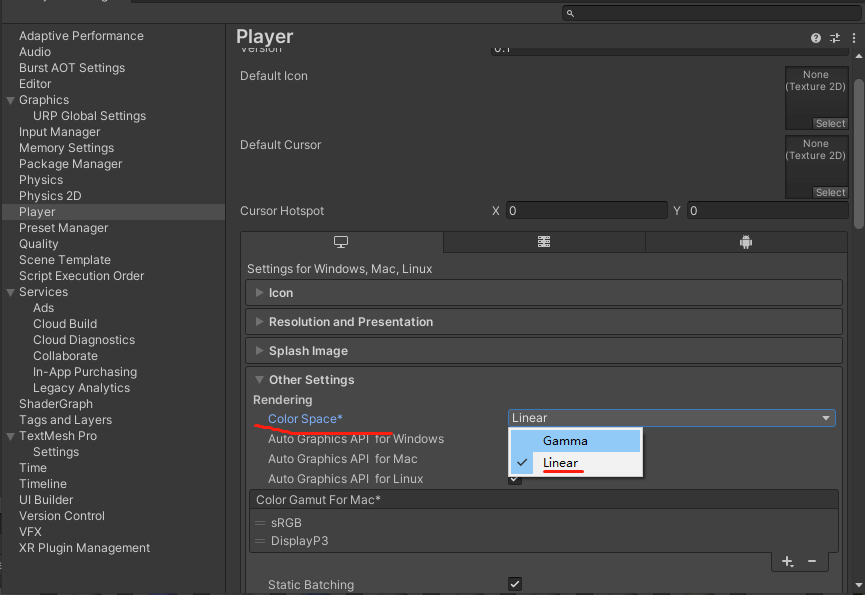
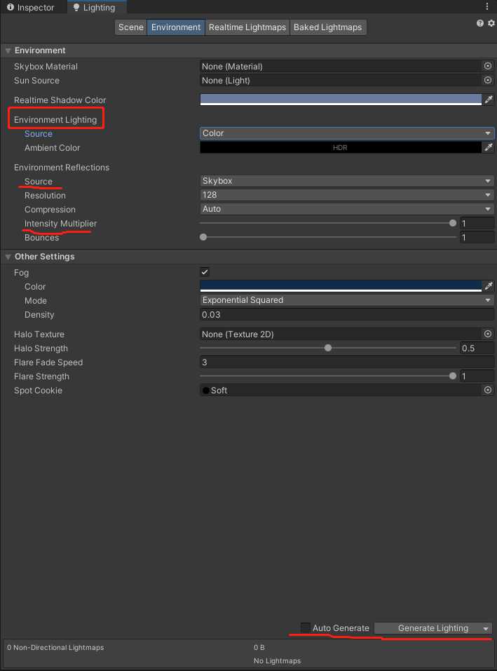

# 光影实例

## 1. 使用光照的一些经验设置

### 1.1 光照类型选择

* Directional ： 日光、月光，无限远的光源，不会随距离而衰竭
* spot ： 锥形的方向光，从添加点向一个方向照射，适合模拟：路灯、台灯、手电、舞台灯、车灯等等锥形光源；
* point ： 全方向的一个点光源，适合模拟：萤火虫、蜡烛、夜光宝石等等
* area ： 面光源，不能是实时的，可以模拟一个静态发光面，适合模拟：荧光灯、led 平面灯 等等

还有一些在设计动画时，为了营造特殊效果，而设计出的“效果光照”，通常用 spot light。这种光源并没有什么现实中的物理意义，只是为了营造效果

所以，光源的使用并没有什么雷打不动的死规则，除了场景中表示物理光源的光照外，可以根据氛围需要，灵活选择需要的光照。

### 1.2 常用属性设置建议

* Directional：室外必备光源，还可以添加多个，提高整体光照效果，夜晚应该降低光照强度
* Range 光照范围：光在场景中的传播距离。但要受到光源形状的限制，比如 spot light 聚光灯，将值增加到超过该上限，就把不会导致任何进一步的范围增加。
* Intensity 光照强度：一般夜晚的光源，在比较符合现实的游戏氛围中，电灯其强度应该设置为 200-600 之间；蜡烛、火把等前度应该介于 50 -100 之间。但这只是建议，根据你的需求可以随意更改，适合的才是最好的
*  Indirect Multiplier 间接光乘数：此光源提供的间接光的强度（在被传感器接收之前多次反弹的光）。
   *  低于1时，间接光在每次从物体反弹时都会变暗。这是真实光照的行为方式，但您可能希望覆盖该行为以实现特定的光照效果。
   *  高于1 ，间接光会随着每次反弹而变亮。这并不自然，但如果您试图照亮场景中的黑暗封闭空间，它会非常有用。
   *  一般默认为1
* color : 光的颜色很重要，合理使用好光色，可以更好地凸显游戏氛围

## 2. color space 色彩空间

色彩空间将影响照明的渲染方式，unity 中有两种不同的色彩空间：

* Gamma 伽马，3D 模板中的默认值
* Linear 线性，URP 模板中的默认值

linear 线性色彩空间工作流程可实现更精确的渲染，增强颜色深度（色彩范围），因此通常是您使用的首选。

## 3. 环境光设置

环境光是存在于场景中但没有特定来源的光。这对于提高可见度或通过照明创建特定的风格效果非常有用。

Unity 的环境实时光照被计算并存储在光照贴图中。

### 3.1 Environment Lighting 环境光照重要属性常用设置：

* Source 源: 
  * skybox：默认如果有天空盒，那就是天空盒 skybox 作为环境光照明，这在白天通常比较有效。
  * color： 如果是夜晚，不想要地光、或者场景中的物体太过明亮，就可以将这个换成别的，比如比较暗的纯色。 
  * Gradient ： 将Source属性设置为Gradient 。现在您可以使用颜色选择器为场景中的天空、赤道和地面环境照明设置特定颜色。
* Intensity Multiplier： 属性控制场景中环境光  的亮度，可以是0到1之间的值（默认值为1 ），同样，晚上需要调得低些

> 注意！！！：  
> 游戏对象需要标记为静态才能包含在光照贴图中以用于环境照明。这是因为光照贴图数据是预先计算的，并且只能为运行时不移动的游戏对象计算。当您为此场景烘焙照明时，您将了解更多相关信息。

## 4. 阴影常用配置方式

> 参考资料：
> 
> [youtube - Brackeys - REALTIME LIGHTING in Unity](https://www.youtube.com/watch?v=wwm98VdzD8s)