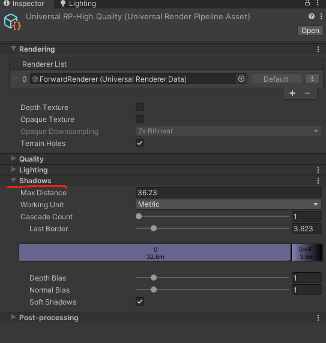
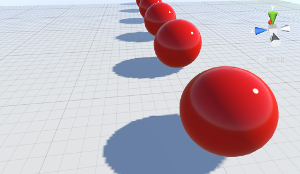
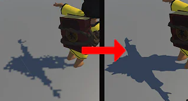
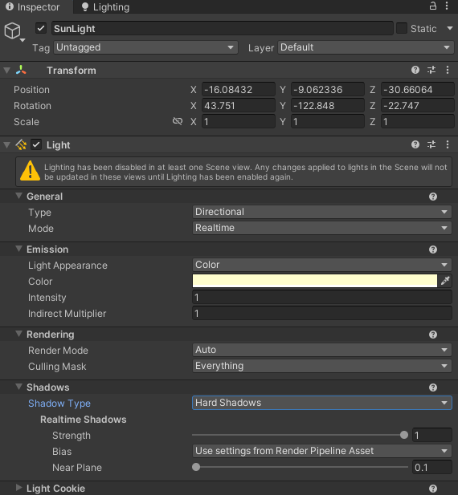
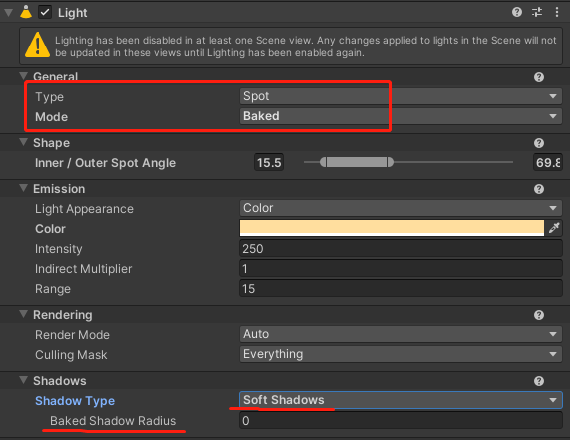

# 场景中配置阴影

## 1. 阴影的作用

* 加强场景中深度感，显示了原本可能看起来平坦的物体的比例和位置
* 当阴影按预期表现时，它们会增加体验的真实感。
* 缺少阴影的游戏，会破坏用户的沉浸感

## 2. 阴影的实现：阴影贴图 Shadow Mapping

阴影贴图，使用类似于深度纹理（ depth textures）的 阴影贴图纹理（shadow maps texture） 进行阴影部分的贴图

通过测试像素是否从光源可见，通过将像素与以纹理形式存储的缓冲区或光源视图的深度图像进行比较来创建阴影。

如果你从光源向外看，你能看到的所有物体都会出现在光中。然而，这些物体背后的任何东西都将处于阴影之中。这是用于创建阴影贴图的基本原理。

渲染阴影场景涉及两个主要的绘制步骤。第一个生成阴影贴图本身，第二个将其应用于场景。根据实现（和灯光的数量），这可能需要两个或更多的绘图通道。

## 3. 渲染管线资源中的阴影设置

> 注意：
> 在渲染管线资源中的阴影设置，会影响当前项目中所有的阴影

1. Project 窗口中，找到 Assets > CreativeCore_Lighting > Settings > Rendering并选择UniversalRP_HighQuality 
2. 在 Inspector 中，找到Shadows部分。

    

   *  Max Distance : 渲染阴影距相机的最大距离 
   *  Working Unit : 单位 Metric 默认米
   *  Cascade Count （仅适用于定向光）： 阴影阶梯（级联、阶段）。解决由定向光产生的阴影像素化问题。
  
        透视锯齿发生是因为阴影贴图的不同区域被相机的透视不成比例地缩放。来自灯光的阴影贴图只需要覆盖摄像机可见的场景部分，这由摄像机的视锥体定义。
          
        使用 Shadow Cascades 时，Unity 会根据与相机的距离将截锥体区域分成两个区域。近端的区域使用单独的阴影贴图，尺寸减小（但分辨率相同）。阴影贴图大小的这些阶段性减小称为级联阴影贴图（有时称为并行分割阴影贴图）。

          
        在项目中配置影子级联时，可以选择使用 0、2 或 4 个级联。Unity 计算级联在相机截锥体内的位置。您使用的级联越多，您的阴影受透视锯齿的影响就越小。增加数量会增加渲染开销。但是，这个开销仍然比在整个阴影上使用高分辨率贴图时要少。
        

        简单来说，使用阴影阶梯，可以提升性能，远处的阴影会变得模糊
        
        比如，下图没有阴影阶梯，所有的影子都是高清的

        
        
        下面设置了4层阶梯，远处的影子逐渐模糊

        
   *  Last Border ： 最后一个阶段的距离
   *   Depth Bias和Normal Bias属性有助于解决对象上的像素处于阴影中但实际上应该被照亮的问题（这被称为阴影痤疮）  。
   *  Soft Shadows ： 软阴影，此属性启用额外处理以使您的阴影看起来更平滑。

> 注意：  
> 1. 如果你的模型的 mesh（一般为较复杂模型，比如人物）造成的阴影，有很多不应该出现的小洞（光斑），就应该把 Normal Bias 设置为 0

> 2. 阴影来自游戏对象，游戏对象离相机越远，阴影就越不明显。这既是因为阴影在屏幕上显得更小，而且因为远处的游戏对象通常不是关注的焦点。您可以通过禁用远程游戏对象的实时阴影渲染来利用此效果。要掩饰超出阴影距离的缺失阴影，您可以使用雾等视觉效果。

## 4. 在光照组件的阴影属性中设置

> 注意：
> 在光照组件的阴影属性中设置，只影响当前光照组件所产生的阴影

* Shadow Type 阴影类型：
  * No Shadows ： 无阴影
  * Hard Shadows 硬阴影：硬阴影产生边缘锐利的阴影。与软阴影相比，硬阴影不真实，但它们涉及的处理较少，也可以应用在很多场景下
  * Soft Shadows 软阴影：效果更好，但消耗计算量更大，可以减少阴影贴图的“块状”混叠效果。
* Baked Shadow Angle 烘焙阴影角度：
    
    如果 Light 组件 Mode设置为Baked或Mixed，Type设置为Directional，Shadow Type设置为Soft Shadows，此属性会为阴影边缘添加一些人工柔化，并使其看起来更自然。

* Baked Shadow Radius 烘焙阴影半径：  
  
  
  如果Mode设置为Baked或Mixed，Type设置为Point或Spot，Shadow Type设置为Soft Shadows，此属性会为阴影边缘添加一些人工柔化，并赋予它们更自然的外观。

* Realtime Shadows 实时阴影:  
  这些属性在Mode设置为Realtime或Mixed并且Shadow Type设置为Hard Shadows或Soft Shadows时可用。使用这些属性来控制实时阴影渲染设置。
  * Strength 强度：使用滑块控制此 Light 投射的阴影的暗度，由 0 到 1 之间的值表示。默认设置为 1
  * Resolution 解析度：控制阴影贴图的渲染分辨率。更高的分辨率会增加阴影的保真度，但需要更多的 GPU 时间和内存使用。
  * Bias 偏移：使用滑块控制阴影被推离灯光的距离，定义为 0 到 2 之间的值。这对于避免错误的自阴影伪影很有用。默认设置为 0.05。
  * Normal Bias 法线偏移: 使用滑块控制阴影投射表面沿表面法线收缩的距离，定义为 0 到 3 之间的值。这对于避免错误的自阴影伪影很有用。默认设置为 0.4。
  * Near Plane 近平面: 可以理解为“最小投影距离”。在渲染阴影时，使用滑块控制近裁剪平面的值，定义为 0.1 到 10 之间的值。该值被限制为 0.1 单位或灯光范围属性的 1%，以较低者为准。默认设置为 0.2。
  
 

 

> 参考资料：
> * [阴影 官方文档](https://docs.unity3d.com/2022.2/Documentation/Manual/Shadows.html)

 

 

配套视频教程：
[https://space.bilibili.com/43644141/channel/seriesdetail?sid=299912](https://space.bilibili.com/43644141/channel/seriesdetail?sid=299912)

文章也同时同步微信公众号，喜欢使用手机观看文章的可以关注

