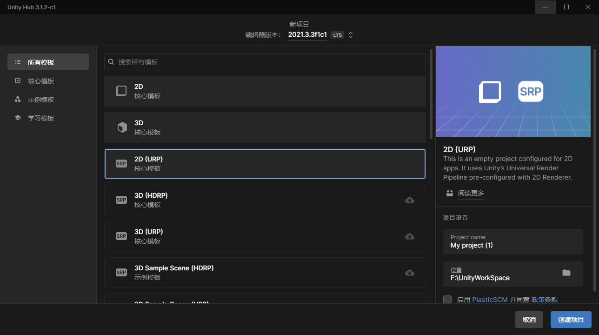
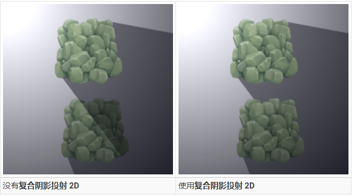

# 2D 光影

## 1. 2D Light

## 2. 2D light 组件各项属性

## 3 使用自定义 shader graph 创建自定义阴影

早先的 Unity 中，是不支持 2D shadow 的，开发者需要自己处理 2D shadows，比较通用的方式，就是通过自定义的  shader graph ，在 Render pipline 中添加 2d shadow 的功能

[youtube Sprite Shadows in Unity ](https://www.youtube.com/watch?v=d_OBjV7c1CY)

## 4 使用 Shadow Caster 2D 配合 URP 生成 2D 阴影效果

使用步骤：

1. 创建经典 2D 项目；
2. 为项目添加 URP 包；
3. 创建 URP Asset(with 2D Renderer);
4. 设置项目的 Graphics 属性面板，将刚创建的 URP Asset 作为项目的渲染管线配置
5. 在场景中，添加 2D light ，根据自己的需要，选择不同的光照组件类型
6. 为需要产生阴影的物体，添加 Shadow Caster 2D 组件

> 注意：  
> * 前面的 1-4 步骤，也可以直接通过在新版本的 Unity Hub 中，选择新建 2D（URP）项目来直接解决
> 
> * 如果在经典的 2D 项目中，无法找到添加 2D light 的选项，建议更改更新的 Unity 版本，或者直接创建 2D UPR 项目

## 5.  Shadow Caster 2D & Composite Shadow Caster 2D

### 5.1 Shadow Caster 2D

这个组件可以设置到包含 2D 素材的游戏对象上，根据 2D 素材来产生阴影、接受阴影

* 启用此选项和​​Self Shadows以将 GameObject Renderer 的轮廓作为阴影的一部分包含在内。启用此选项并禁用自身阴影以从阴影中排除渲染器的轮廓。此选项仅在存在有效渲染器时可用。
* 启用它可以让渲染器投射阴影。
* 启用它可以让渲染器在自身上投射阴影。

### 5.2 Composite Shadow Caster 2D

Composite Shadow Caster 2D将多个Shadow Caster 2D的形状合并为一个Shadow Caster 2D。通过转到菜单将Composite Shadow Caster 2D组件添加到游戏对象： Component > Rendering > 2D > Composite Shadow Caster 2D ，然后将具有Shadow Caster 2D组件的父游戏对象添加到它。Composite 组件合并此层次结构中的所有 Shadow Caster 2D，包括父级上的所有 Shadow Caster 2D。

> 参考资料：
> * [URP 2D 光影 官方文档](https://docs.unity3d.com/Packages/com.unity.render-pipelines.universal@14.0/manual/Lights-2D-intro.html)

 

 

配套视频教程：
[https://space.bilibili.com/43644141/channel/seriesdetail?sid=299912](https://space.bilibili.com/43644141/channel/seriesdetail?sid=299912)

文章也同时同步微信公众号，喜欢使用手机观看文章的可以关注

