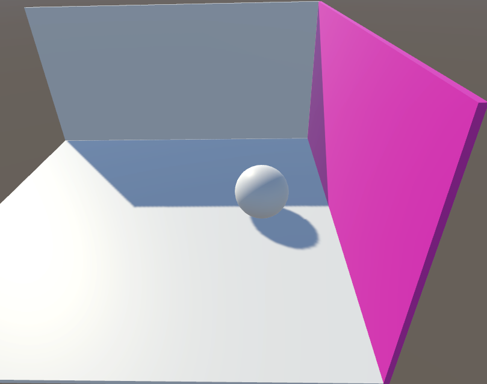
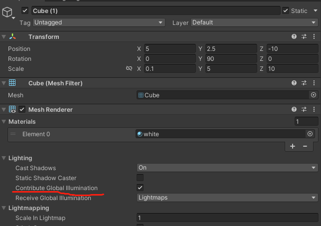
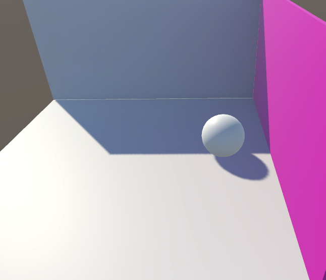
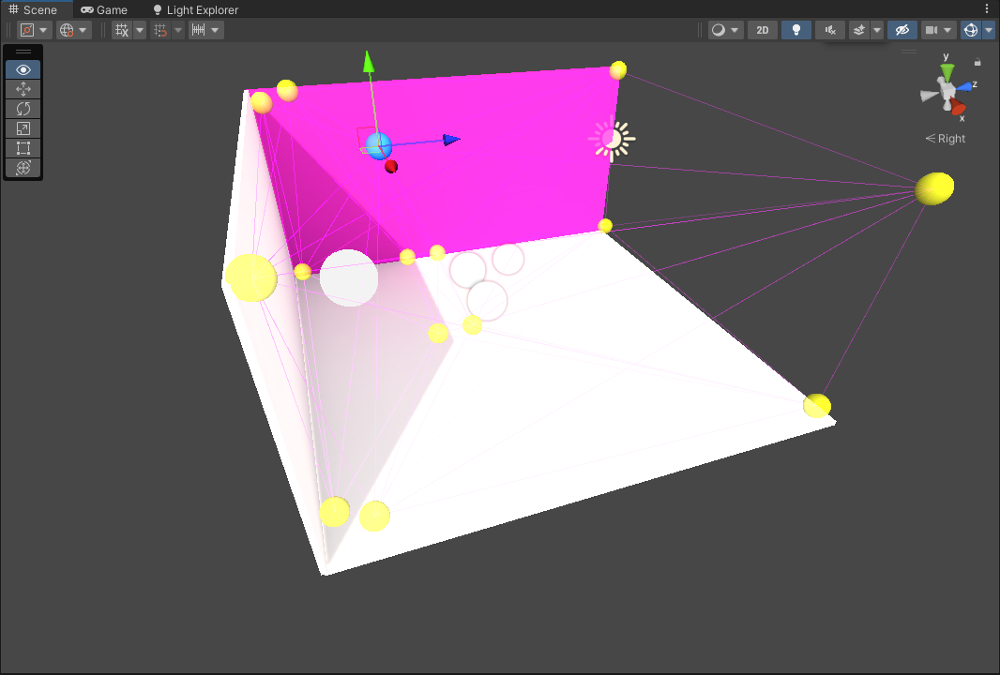
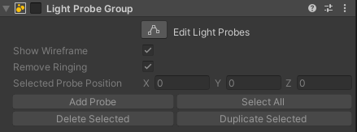
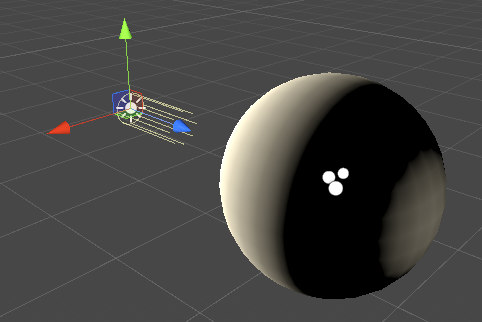
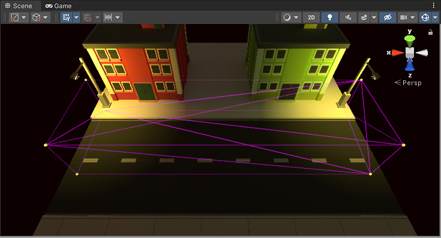
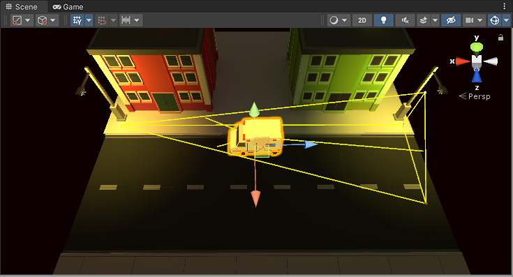

# 光照探针 Light Probe

## 1. 概念

首先，我们来回顾全局光照（Global Illumination ）的设置，就是为了获取反射光影效果，增强场景真实性

| 光照模式 | 全局光照设置 （Global Illumination） | 物体设置   | 间接（反射）光影效果 | 是否产生烘焙贴图           | 直接光影 |
| -------- | ------------------------------------ | ---------- | -------------------- | -------------------------- | -------- |
| realtime | Realtime Global Illumination         | not static | 有效果               | 无烘焙贴图，但会有实时贴图 | 有       |
| realtime | Mixed Global Illumination            | static     | 无效果               | 有烘焙贴图                 | 有       |
| baked    | Mixed Global Illumination            | not static | 无效果               | 无烘焙贴图                 | 无       |
| baked    | Mixed Global Illumination            | static     | 有效果               | 有烘焙贴图                 | 有       |
| Mixed    | Mixed Global Illumination            | not static | 无效果               | 无烘焙贴图                 | 有       |
| Mixed    | Mixed Global Illumination            | static     | 有效果               | 有烘焙贴图                 | 有       |

图1：静态、非静态物体，都没有配置好全局光照（间接光照）的效果

图2：静态物体有全局光照（间接光照）、非静态物体无间接光照的效果

图3：使用光照探针配合光照贴图，静态、非静态物体，都有间接光照效果

> 注意：
> * 实时光照，如果想要有间接光影效果，必须将全局光照配置为 Realtime Global Illumination
> * 实时光照，如果想要有间接光影效果，还需要将物体设置为 Contribute Global Illumination 
    
> * 但实际游戏中，是不会使用实时全局光照  Realtime Global Illumination(耗费大，而且效果差并非完全实时)，所以要用 Mixed 光照配合 Mixed Global Illumination
> * 为了弥补 非静态物体的间接光照效果，需要使用光照探针

### 1.1 什么是光照探针

* 实时 Realtime 光照太浪费资源，一般不会大范围使用在实际游戏场景中；
* 烘焙 Baked 光照又不能作用在动态物体上，这就有了光照探针，来弥补光照贴图的不足
* 对于 Mixed 光照，虽然可以将光影效果投射到移动物体上，但移动物体不会从静态环境中接收到反射光，所以也需要使用光照探针

未添加 光照探针：

正在添加 光照探针：

添加光照探针后：

光照探针大致原理：在某一光照探针的所在位置点上对光照信息进行采样，然后从该光照探针相邻的其他光照探针的位置上对光照信息进行采样，把这些采样得到的光照信息进行插值运算，便可算出这些光照探针之间某个位置的光照信息。

### 1.2 光照探针作用

光探测器（光照探针 Light Probe）存储有关场景中照明的“烘焙”信息。

光照贴图存储有关光线照射场景中表面的光照信息，但光照探测器存储有关光线穿过场景中空白空间的信息。

说白了，光照贴图只存储 mesh 表面的光影信息；而光照探针，存储空白空间的光影信息，包括直接光和间接光（反射光），是对光照贴图的补充

## 2. 使用 光照探针组  Light Probe Group

### 2.1 概念

光照探针组就是一组光照探针，默认是一个立方体，4*2一组，共八个光照探针组成。

可以通过编辑，增加或删除光照探针，也可以随意移动光照探针位置

### 2.2 使用方式

可以从菜单中添加 Light Probe Group 到当前场景中：Component > Rendering > Light Probe Group

光照探针组初始形态：

### 2.3 属性

光照探针组组件在 Inspector 窗口如下：

* Edit Light Probes: 编辑光照探针，点击后，可以在场景中编辑光照探针组中的光照探针，进行增加、删除，移动位置等操作
* Show Wireframe ：显示光照探针之间的连线组成的线框，如果禁用，则只显示探针所在点，而不显示之间的连线；
* Remove Ringing ：去除振铃。启用此属性后，Unity 会自动从场景中移除 Light Probe 振铃。  
  在某些情况下，Light Probe 会表现出一种称为“振铃”的不良行为。当 Light Probe 周围的光线存在显着差异时，通常会发生这种情况。例如，如果光探头的一侧有亮光，而另一侧没有光，则光强度可能会在背面“过冲”。这种过冲会在背面产生一个光点。
      
    启用Remove Ringing。Unity 会自动移除不希望出现的光点。但是，这通常会降低 Light Probes 的准确度，并降低光线对比度，因此您必须检查视觉结果
* Selected Probe Position : 选定光照探针所在位置

### 2.4 光探头放置故障排除

对 Light Probe 位置的选择必须考虑到光照是在 Light Probe 组之间插值的。如果您的 Light Probe 没有充分覆盖整个场景中的光照变化，则可能会出现问题。

下面的示例显示了一个夜间场景，两侧有两个明亮的路灯，中间有一个黑暗区域。如果 Light Probe 仅放置在路灯附近，而在黑暗区域没有放置，则来自灯的照明“流血”穿过黑暗的缝隙，照射到移动的物体上。这是因为照明从一个亮点插入到另一个亮点，中间没有关于暗区的信息。

如果您使用的是实时或混合光，则此问题可能不太明显，因为只有间接光会穿过间隙。如果您完全使用，问题会更加明显烤灯
，因为在这种情况下，移动物体上的直射光也是由 Light Probes 插入的。在此示例场景中，两个灯被烘焙，因此移动对象从 Light Probes 获得直接光。在这里您可以看到结果 - 移动的物体（救护车）在穿过黑暗区域时保持明亮，这不是预期的效果。黄色线框四面体显示插值发生在街道明亮的一端与另一端之间。

这是一个不希望的效果 - 救护车在通过黑暗区域时仍然保持明亮，因为没有在黑暗区域放置光探头。

为了解决这个问题，你应该在黑暗区域放置更多的Light Probes，如下图：

现在场景在黑暗区域也有光探针。因此，移动的救护车在从场景的一侧行驶到另一侧时会呈现较暗的灯光。

 

 

> 参考资料：
> * [光照探针文档 - Unity 官方](https://docs.unity3d.com/2022.2/Documentation/Manual/LightProbes.html)
> * [Brackeys - youtube - HIGH QUALITY LIGHTING using Light Probes](https://www.youtube.com/watch?v=_E0JXOZDTKA)

 

 

配套视频教程：
[https://space.bilibili.com/43644141/channel/seriesdetail?sid=299912](https://space.bilibili.com/43644141/channel/seriesdetail?sid=299912)

文章也同时同步微信公众号，喜欢使用手机观看文章的可以关注

