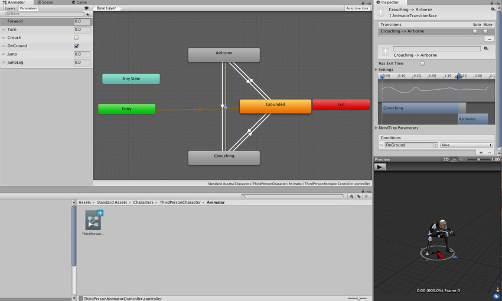
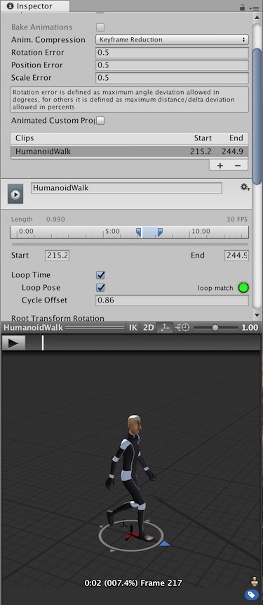
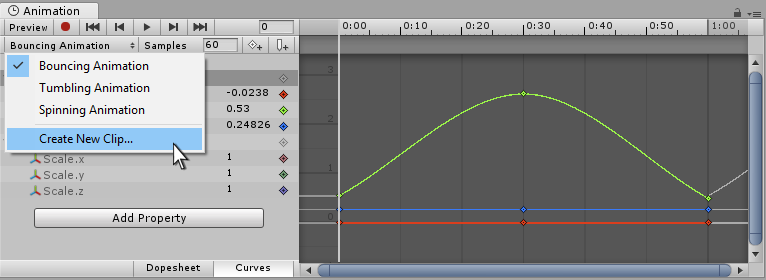
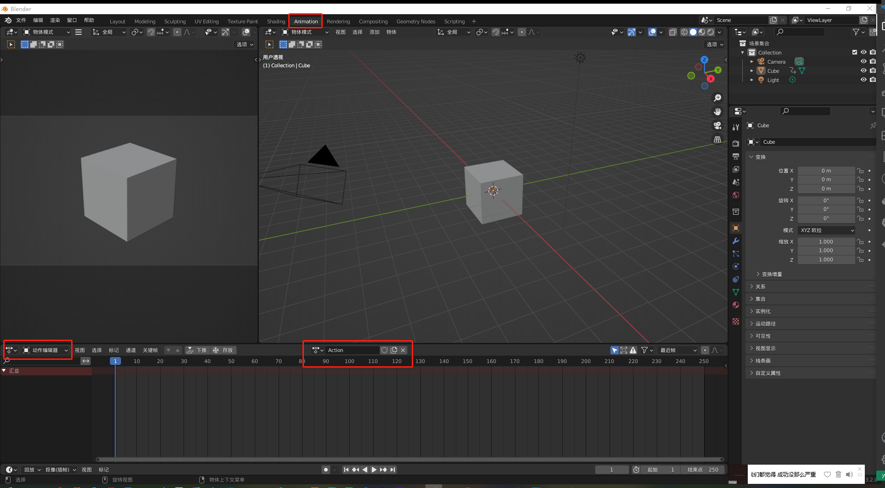
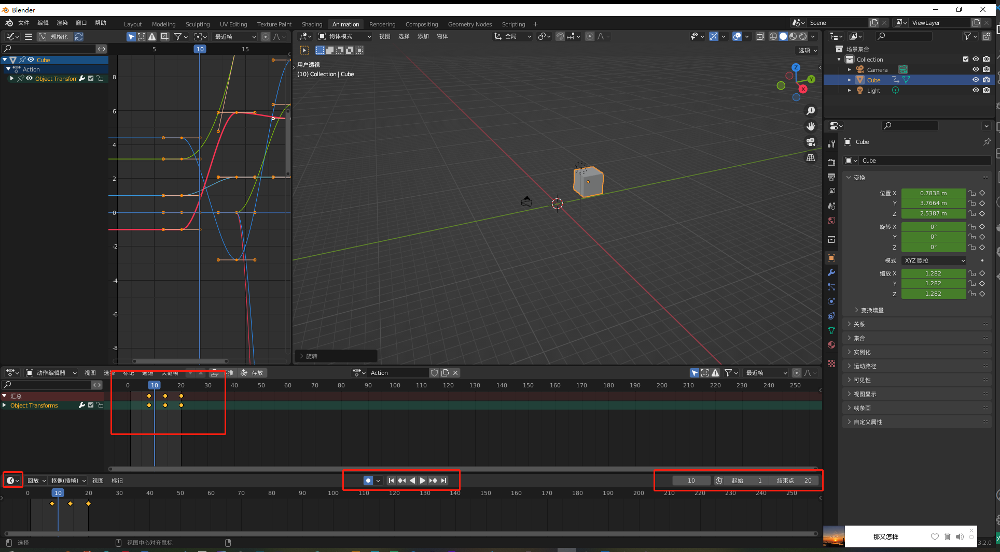
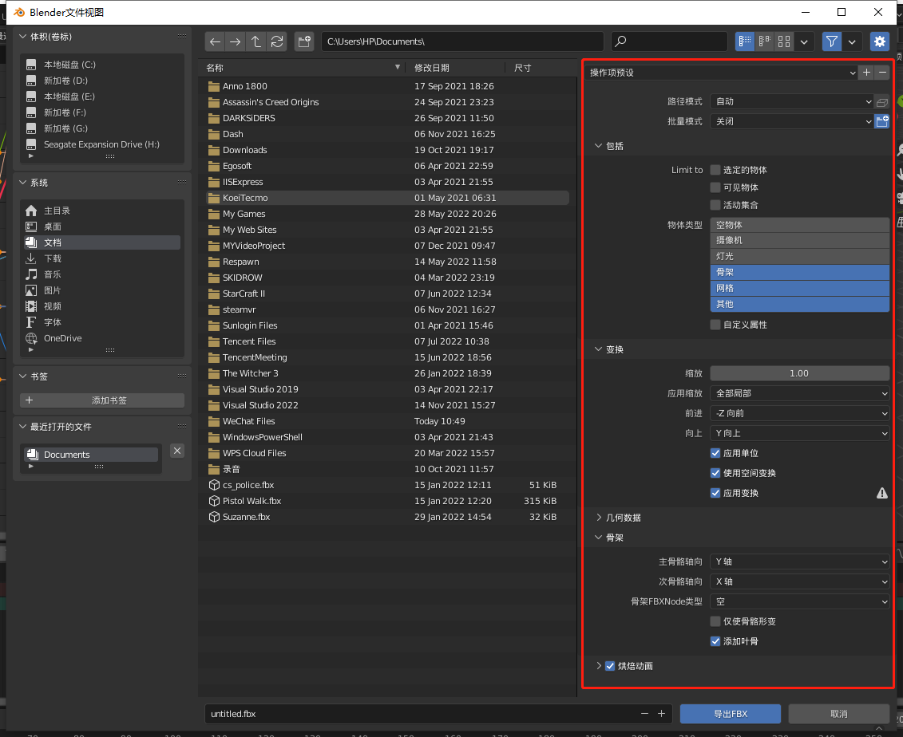
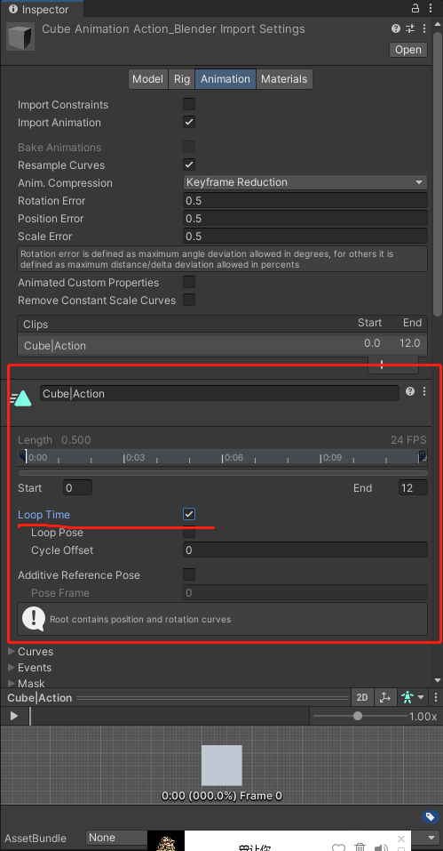
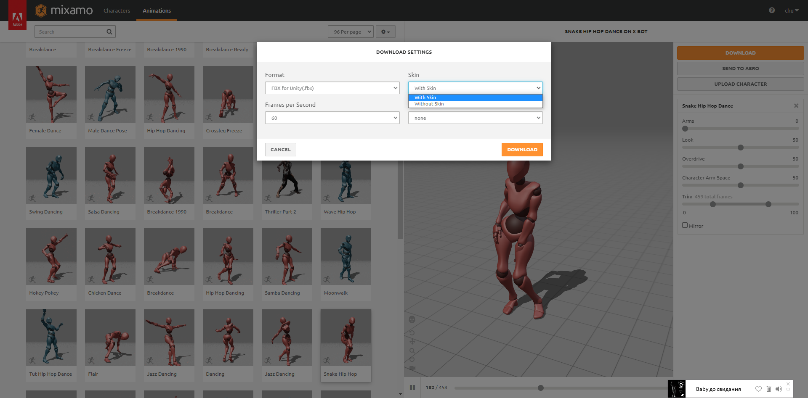

# Unity 动画系统入门

## 1. Unity 动画系统简介

Unity 有一个丰富而复杂的动画系统（有时称为“Mecanim”）。该系统具有以下功能：

* 为 Unity 的所有元素（包括对象、角色和属性）提供简单工作流程和动画设置。
* 支持导入的动画剪辑以及 Unity 内创建的动画
* 人形动画重定向 - 能够将动画从一个角色模型应用到另一角色模型。
* 对齐动画剪辑的简化工作流程。
* 方便预览动画剪辑以及它们之间的过渡和交互。因此，动画师与工程师之间的工作更加独立，使动画师能够在挂入游戏代码之前为动画构建原型并进行预览。
* 提供可视化编程工具来管理动画之间的复杂交互。
* 以不同逻辑对不同身体部位进行动画化。
* 分层和遮罩功能

上面这些是 Unity 官方文档中的介绍。但实际上，真正复杂的动画还是需要在专业的动画制作软件中进行，然后作为素材导入到 Unity 中，供游戏开发使用。

通常，高度复杂的对象或深度动画是在 Autodesk Maya 或 Blender 等外部数字内容创建(DCC) 应用程序中创建的。这些 DCC 具有强大的动画工具套件，可帮助简化动画师的创作过程。这些通常包括用于创建绑定的工具（用于动画角色的基本骨骼状结构）、头发和毛皮等动力学、保存的姿势等。

正是出于这个原因，Unity 编辑器内的动画被保存用于更简单的对象，或者当动画与特定场景相关联时；例如，在游戏关卡中的两点之间移动的平台。在同一个项目中使用外部和内部创建的动画非常常见。

* Autodesk Maya：长期以来一直被认为是电影、电视、动画功能和游戏中动画创作的行业标准。Maya 是一种强大的数字艺术创作工具，也可用于动画之外的多种用途，包括模型生成和视觉效果。
* Autodesk 3ds Max：与 Maya 类似，3ds Max 是一种多功能数字艺术创作工具，历来是游戏行业的首选软件。
* Blender：完全免费和开源，Blender 长期以来一直是独立社区创作者的热门选择，但也开始在专业市场上获得巨大的吸引力。与 Max 和 Maya 一样，Blender 是一个多用途工具，具有强大的动画工具集合。

## 2. 动画剪辑

### 2.0 动画剪辑：Animation Clip 概念

在 Unity 中，单个动画存储在一个名为Animation Clip的资源中。它们与创建剪辑时选择的对象相关联，并存储用于创建特定动画的所有 **数据** 。

动画剪辑存储中的数据信息是随时间更改，可以是形变，如：Transform 中的位置、大小、旋转；也可以是所关联对象的外观着色变化（Shading），比如颜色、发光度等等。

动画剪辑可以是任意时间长度，单个游戏对象可以有多个与之关联的动画剪辑。

Unity 中，可以自建较为简单的动画剪辑，也支持导入外部动画。

### Unity 自建动画

在 Unity 的 Animation 窗口中还可以创建和编辑动画剪辑。这些剪辑可针对以下各项设置动画：

* 游戏对象的位置、旋转和缩放
* 组件属性，例如材质颜色、光照强度、声音音量
* 自定义脚本中的属性，包括浮点、整数、枚举、矢量和布尔值变量
* 自定义脚本中调用函数的时机

### 外部源动画

从外部源导入的动画剪辑可能包括：

* 在动作捕捉工作室中捕捉的人形动画
* 美术师在外部 3D 应用程序（如 Blender、 Autodesk® 3ds Max® 或 Autodesk® Maya®）中从头开始创建的动画
* 来自第三方库（例如 Unity 的 Asset Store）的动画集
* 从导入的单个时间轴剪切的多个剪辑。

### 2.1 Unity 内创建动画剪辑

1. 打开 Animation 窗口：顶部菜单：__Window > Animation > __Animation__ ，Ctrl + 6 是快捷键
2. 在 Hierarchy 中选择要创建动画的游戏对象，在 Animation 窗口时间轴区域的中心位置点击“Create”按钮，创建动画剪辑
   
3. 在打开的窗口中，将动画剪辑保存在 Assets 文件夹内，最好新建一个专门用来存放动画剪辑的 Animations 文件夹，分类保存素材

    保存这个新的空动画剪辑时，Unity 会执行以下操作：

    * 创建新的 Animator Controller 资源
    * 将新剪辑以默认状态添加到 Animator Controller 中
    * 将 Animator 组件添加到要应用动画的游戏对象
    * 为 Animator 组件分配新的 Animator Controller

    
4. 编辑动画剪辑，添加关键帧，添加变化，形成完整动画片段
5. 如果需要，可以为同一个游戏对象添加多个动画剪辑
   
6. 同一对象的不同的动画剪辑可以放入一个动画控制器中，进行管理，满足不同条件是进行切换
   
   
### 2.2 创建并导入 Blender 动画

1. Blender Animation 工作区中，在 动画摄影表 窗口中，调整模式为：动作编辑器，在中间点击 “新建” 按钮，创建 Action "动作" ，这个Blender 动画系统中的 Action 动作，其实就对等于 Unity 里的 Animation Clip 动画剪辑（片段）
   
2. 在 时间线 窗口中，设置好结束点帧数，定位到关键帧，配置对象各项属性，blender 动画系统会自动补帧，形成动画
    
3. 导出为 FBX ，注意下图中的各个配置项
   
4. 在 Unity 中，导入 FBX，并调整导入参数，为了让动画循环播放，将 LoopTime 复选框勾选
   
5. 将模型素材直接拖拽入 Hierarchy 或者 Scene 窗口，创建游戏对象，并将模型中的动画剪辑，直接拖拽到 Hierarchy 中的游戏对象上
   拖拽动画剪辑的操作会产生下面这些效果，都由 Unity 自动完成：
   * 为游戏对象添加 Animator 组件
   * 生成新的动画控制器 Animation Controller，以游戏对象命名
   * 将 动画剪辑 自动添加到 Animation Controller，并配置为初始动画
6. 直接预览动画，或点击游戏运行，查看动画运行效果

### 2.3 导入 网络动画资源

对于一些学习 Unity 开发的程序员来说，模型制作已经很让人崩溃，更别说骨骼绑定和动画制作了。但学习过程中，还必须使用一些素材，最好的方式，就是去寻找网上免费资源。

基本上，各个不同网站上获取的资源，只要格式（后缀名）相同，操作基本一致，咱们在此就挑选其中最具代表性，质量最高的网站之一：[https://www.mixamo.com/](https://www.mixamo.com/)，来作为我们的例子。

https://www.mixamo.com/ 是 Adobe 为大家提供的免费的人物模型及动画资源网站，还提供自动骨骼绑定等功能。

大家甚至可以将自己做好的人物模型上传到 Mixamo 上，自动绑定骨骼，选取动画，并套用到自己的模型上。这样，你只需要进行人物建模，其他的交给 Mixamo，就能获取到一个完整的包含骨骼，以及各种大多数动作的角色了。

### 导入 Mixamo 角色&动画

1. 在 Mixamo.com 网站上注册并登录，如果已经有 Adobe 账号，可以直接登录；
2. 网站左上角有两个分页，一个 Characters 角色，一个 Animations 动画，可以分开下载；
3. 选择在左侧一个角色，然后到右侧动画中，选中一个或一组动画，点击 Download 下载
   
4. 配置适合自己的下载选项后，就可以下载了
   
5. 导入方式参照上面导入Blender 中的 4-6 步

### 导入素材时材质或纹理丢失问题解决

导入素材到 Unity 中时，一般来说，其中的材质和纹理需要配置一下，否则导入的会是白模（无材质、纹理）。大多数情况，都可以通过解压材质、纹理，修复材质方式解决。

