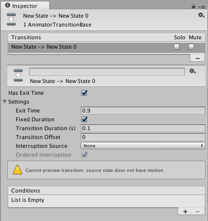
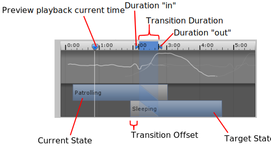

# Unity 动画控制器 Animation Controller

## 1. Animation Controller 动画控制器

Animator Controller允许您安排和维护一组动画剪辑和相关的动画过渡

对于一个角色或对象。在大多数情况下，有多个动画并在某些游戏条件发生时在它们之间切换是正常的。

例如，您可以从步行切换动画剪辑，每当按下空格键时跳转到动画剪辑。但是，即使您只有一个动画剪辑，您仍然需要将其放入 Animator Controller 中才能在游戏对象

Animator Controller 引用了其中使用的动画剪辑，并使用状态机，它可以被认为是动画剪辑和过渡的流程图，或者是在 Unity 中用可视化编程语言编写的简单程序。

当您开始使用动画窗口为游戏对象设置动画时，或者当您将动画剪辑附加到游戏对象时，Unity 会自动创建一个动画控制器。

要手动创建 Animator Controller，请右键单击 Project 窗口，然后单击Create > Animator Controller。

## 2. Animation State 动画状态 和 Animation State Machine 动画状态机

动画状态  Animation Stat 是动画状态机 Animation State Machine 的基本构建模块

当角色处于一个状态下时，每个状态都包含一个动画序列（或混合树）在播放

下图中是动画状态属性面板：

* Motion (动作、运动): 当前状态下挂接的动画片段（Animation clip）或 混合树（blend tree）
* Speed （速度）： 默认为1 ，当前 Motion 的播放速度，可以设置为负数，比如 -1 就是倒放 。另外，启用参数以使用脚本中的自定义值修改速度。例如，您可以将速度与自定义值相乘以减慢或加快播放速度。
* Motion Time（运动时间）：用于播放此状态的动作的时间。启用参数以使用脚本中的自定义值控制运动时间。
* Mirror （镜像）：此属性仅适用于具有人形动画. 启用以镜像此状态的动画。启用参数以启用或禁用脚本的镜像。
* Cycle Offset （周期偏移）：添加到运动状态时间的偏移量。此偏移不影响运动时间。启用参数以指定脚本的循环偏移。
* Foot IK （足部反向动力学）：此属性仅适用于具有类人动画的状态。启用此状态的 Foot IK。
* Write Defaults（写入默认值）：AnimatorStates 是否为不通过其运动设置动画的属性写入默认值。
* Transitions（过渡）：源自此状态的转换列表。

## 3. Animation Transaction 动画过渡

动画过渡允许状态机从一种动画状态切换或混合到另一种。

转换不仅定义了状态之间的混合应该花费多长时间，而且还定义了它们应该在什么条件下激活。

在动画控制器中，可以将转换设置为仅在某些条件为真时发生。

例如，您的角色可能具有“巡逻”状态和“睡眠”状态。您可以将巡逻和睡眠之间的转换设置为仅在“警觉”参数值低于某个水平时发生。

### 过渡属性

* Has Exit Time :退出时间是一种不依赖于参数的特殊转换。相反，它依赖于状态的标准化时间。检查以使转换在Exit Time中指定的特定时间发生。
* Settings: 包含以下详细过渡设置的折叠式菜单。
* Exit Time: 
    如果选中Has Exit Time，则此值表示转换可以生效的确切时间。  
    这以标准化时间表示（例如，退出时间为 0.75 表示在播放了 75% 动画的第一帧上，退出时间条件为真）。在下一帧，条件为假。
    对于循环动画，每个循环都会评估退出时间小于 1 的过渡，因此您可以使用它来为每个循环的动画中的适当时间安排过渡。

    具有退出时间的转换大于 1 只计算一次，因此它们可用于在固定数量的循环后在特定时间退出。例如，退出时间为 3.5 的转换在三个半循环后评估一次。
* Fixed Duration 固定时间:  
  如果选中Fixed Duration框，则转换时间以秒为单位进行解释。如果未选中“固定持续时间”框，则转换时间被解释为源状态标准化时间的一小部分。
* Transition Duration 过渡时间：  
  转换的持续时间，以标准化时间或秒为单位，取决于固定持续时间模式，相对于当前状态的持续时间。
  
  这在过渡图中可视为两个蓝色标记之间的部分。
* Transition Offset 过渡偏移:  
  在转换到的目标状态下开始播放的时间偏移量。  
  例如，值 0.5 表示目标状态在其时间线的 50% 处开始播放。
* Interruption Source （中断源）:  
  使用它来控制可能中断此转换的情况。  
  从概念上讲，中断顺序的工作方式就像转换排队，然后解析从插入的第一个转换到最后一个转换的有效转换。
  * None : 不要再添加任何过渡。
  * current State:从当前状态排队转换。
  * Next State :排队从下一个状态的转换。
  * Current State then Next State:将当前状态的转换排队，然后将下一个状态的转换排队。
  * Next State the Current State:将下一个状态的转换排队，然后将当前状态的转换排队。
* Ordered Interruption （有序中断）:  
  确定当前转换是否可以被其他转换打断，与它们的顺序无关
  * Checked:  已找到有效的转换或当前转换。
  * Unchecked: 已找到有效的转换。
* Conditions （条件）:  
  转换可以有一个条件、多个条件或根本没有条件。如果您的过渡没有条件，Unity 编辑器仅考虑Exit Time，并且在达到退出时间时发生过渡。如果您的转换有一个或多个条件，则必须在触发转换之前满足所有条件。

    条件包括：

    - 事件参数（条件中考虑的值）。
    - 条件谓词（如果需要，例如，浮点数的“小于”或“大于”）。
    - 参数值（如果需要）。

    如果您为过渡选择了Has Exit Time并且有一个或多个条件，请注意 Unity 编辑器会在退出时间。这使您可以确保在动画的某个部分发生过渡。

### 过渡图形

要手动调整上面列出的设置，您可以直接在字段中输入数字或使用转换图。当操作视觉元素时，转换图会修改上述值。

使用以下方向更改图表视图中的转换属性：

* 拖动持续时间“out”标记以更改过渡的持续时间。
* 拖动Duration “in”标记以更改过渡的持续时间和Exit Time。
* 拖动目标状态以调整Transition Offset。
* 拖动预览播放标记以在检查器底部的预览窗口中拖动动画混合。

### 混合树状态过渡

如果属于此转换的当前或下一个状态是混合树状态，则混合树参数出现在检查器中。调整这些值以预览在将混合树值设置为不同配置时过渡的外观。如果您的混合树包含不同长度的剪辑，您应该测试同时显示短剪辑和长剪辑时的过渡效果。调整这些值不会影响过渡在运行时的行为方式；它们仅用于帮助您预览过渡在不同情况下的外观。

> 参考资料：
> * [CC 动画官方教程](https://learn.unity.com/tutorial/control-animation-with-an-animator)
>
> * [动画控制器官方文档](https://docs.unity3d.com/2023.1/Documentation/Manual/class-AnimatorController.html)
> * [动画过渡官方文档](https://docs.unity3d.com/2023.1/Documentation/Manual/class-Transition.html)
> * [状态机转换中断----官方博客文章](https://blog.unity.com/technology/wait-ive-changed-my-mind-state-machine-transition-interruptions)