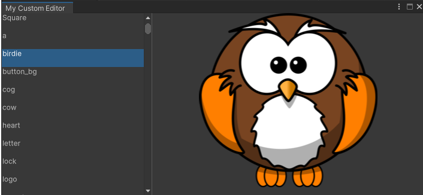
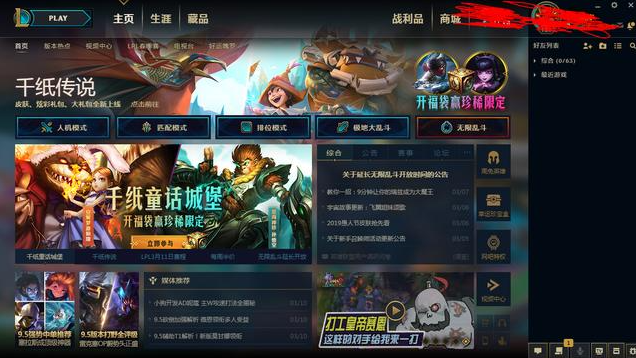
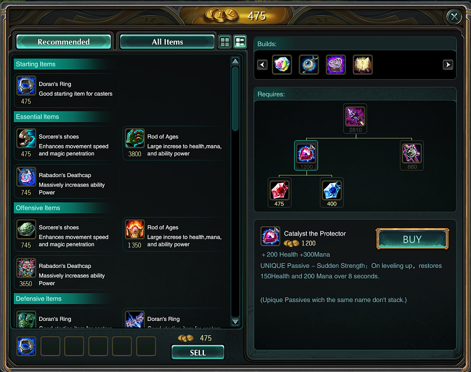

# User Interface 用户界面

> 相关资料
>
> - [创建用户界面 UI（官方手册）](https://docs.unity3d.com/cn/2021.2/Manual/UIToolkits.html)
> - [Ruby's Adventure UI 教程](https://learn.unity.com/tutorial/shi-jue-feng-ge-yong-hu-jie-mian-tai-tou-xian-shi?uv=2020.3&projectId=5facf921edbc2a2003a58d3a)
> - [其他 UI 资料- UI 系统学习](https://pmlpml.github.io/unity3d-learning/09-ui.html)

## 1. 概念

### 1.1 User Interface

- Unity 用户界面：  
   指的是 Unity 编译器的用户界面，unity 编译器本身就是开源的，也可以随意更改，添加功能，这也是 Unity 的一大特色
  

- Game（或用 Unity 创建的应用）起始界面：  
   开启游戏前的界面
  

- 运行时（runtime）界面:  
  进入游戏后的游戏内操作界面
  

## 2. 最新 Unity 中的 3 大 UI 系统

### 2.1 UI 工具包

UI toolkit UI 工具包是 Unity 中最新的 UI 系统。它旨在优化跨平台的性能，并基于标准 Web 技术。您可以使用 UI 工具包为 Unity 编辑器创建扩展，并为游戏和应用程序创建运行时 UI（如果您安装了 UI 工具包软件包）。

Unity 打算让 UI 工具包成为新 UI 开发项目的推荐 UI 系统，但它仍然缺少 Unity UI (uGUI) 和 IMGUI 中的一些功能。

一句话总结：  
全能 UI 系统，而且是 unity 未来的 UI 发展方向，暂时还缺少部分功能，建议优先使用，遇到不足的，再选择别的 UI 系统补上

### 2.2 Unity UI 软件包 (uGUI)

Unity 用户界面 (Unity UI) 软件包（也称为 uGUI）是一个较旧的、基于游戏对象的 UI 系统，您可以使用它为游戏和应用程序开发运行时 UI。在 Unity UI 中，即可使用组件和 Game 视图来排列和定位用户界面并设置其样式。它支持高级渲染和文本功能。

现在使用 Unity 的公司，旧项目中大多数还在使用 uGUI ，甚至是它的前身 nGUI（第三方 ui），Ruby's Adventure 教程中，使用的还是 uGUI。

### 2.3 NGUI

第三方 UI 系统（[AssetStore 链接](https://assetstore.unity.com/packages/tools/gui/ngui-next-gen-ui-2413)），需付费（现价$95），除非入职公司旧系统中，还在使用 NGUI，否则不推荐学习，uGUI 是模仿 NGUI 做出来的，但现在据说已经比 NGUI 更好用，功能更强

### 2.4 IMGUI

立即模式图形用户界面 (IMGUI) 是一个代码驱动的 UI 工具包，它使用 OnGUI 函数以及实现它的脚本来绘制和管理用户界面。您可以使用 IMGUI 来创建脚本组件的自定义 Inspector，Unity 编辑器的扩展以及游戏内调试显示。不推荐用于构建运行时 UI。

纯代码 UI 系统，适合程序员做游戏内部测试系统、控制台的 UI

## 3. UI 系统的对比和选择

### 3.1 UI 系统对比：

对比请参考文档: [Unity 中 UI 系统的对比](https://docs.unity3d.com/cn/2021.2/Manual/UI-system-compare.html)

### 3.2 UI 系统选择依据建议

- 学习：  
  建议 unity 的三个都学习，以第一个为 UI toolkit 为主，不建议再学 nGUI
- 旧项目：  
  以保持原项目系统一至性为原则，使用 uGUI 或 NGUI
- 新项目：  
  尽量使用 Unity UI Toolkit，这个是 Unity 主推的方向，如果有它暂时不能实现的功能，再考虑使用 uGUI 或 IMGUI
- 游戏内测试系统（包括控制台）：  
  UNity UI Tookit 不能实现的话，就使用 IMGUI

## 4. uGUi 入门

UGUI（Unity UI） 是一组用于为游戏和应用程序开发用户界面的工具。 它是一个基于游戏对象的 UI 系统，它使用组件和游戏视图来排列、定位和设计用户界面。

> 注意：  
>  UGUI 不能在 Unity 编辑器中创建或更改用户界面。

UGUI 的优势：

- 所见即所得（WYSIWYG）设计工具
- 支持多模式、多摄像机渲染
- 面向对象的编程

### 4.1 UGUI 基本使用步骤

1. 创建 画布 Canves
2. 在 画布 Canves 中添加 UI 组件（文本、文本框、按钮等等）
3. 设置好布局、动画，以及摄像机、特效等
4. 需要的话，再添加交互事件
