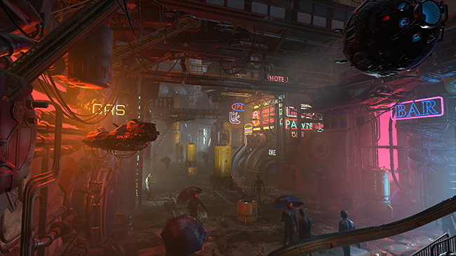
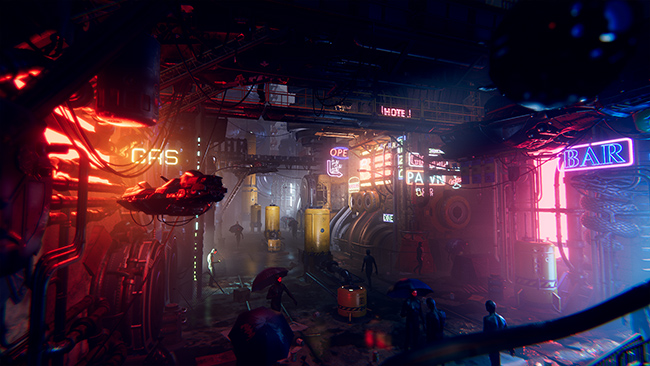
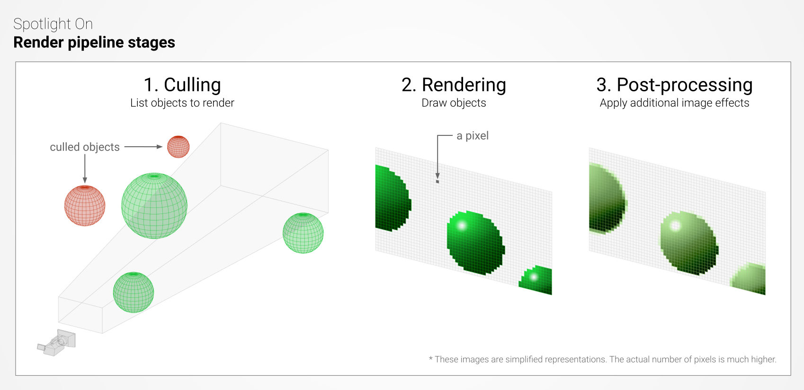
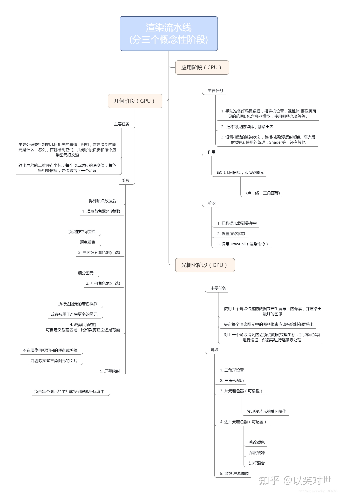
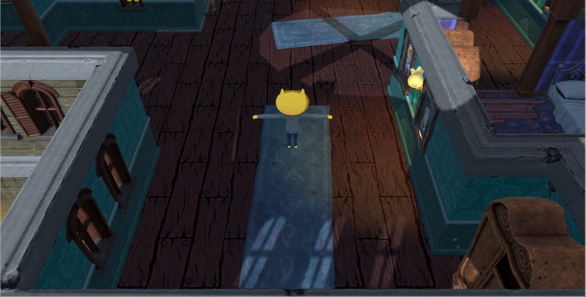
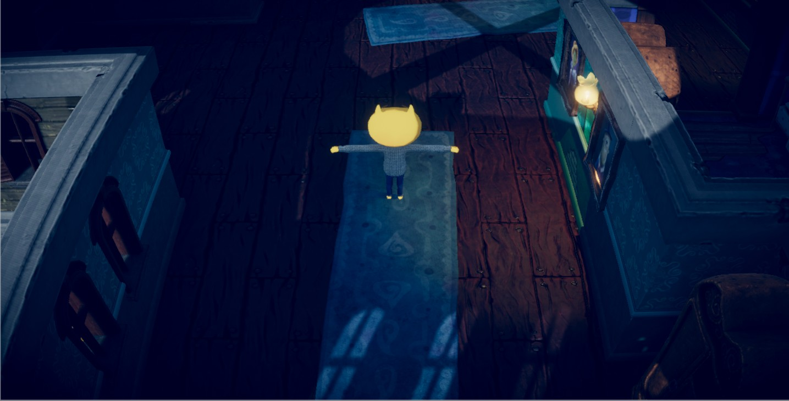
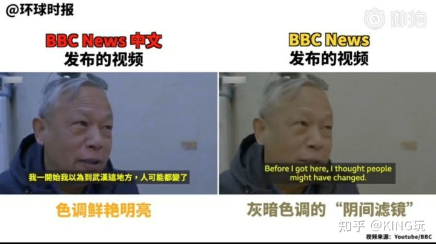
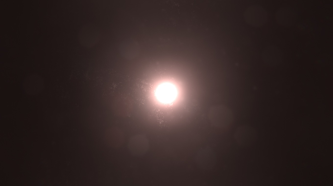
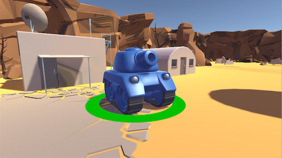
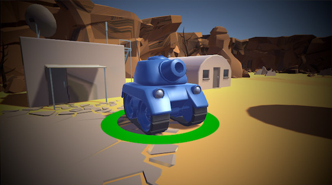

# 后期处理

> 参考资料
>
> - [后期处理官方手册](https://docs.unity3d.com/cn/2021.2/Manual/PostProcessingOverview.html)
>
> * [后期处理栈包官方手册](https://docs.unity3d.com/Packages/com.unity.postprocessing@3.2/manual/index.html)

## 1. 后期处理简介

Unity 提供了许多后期处理效果和全屏效果，可以用很少的设置时间大大改善应用程序的外观。可以使用这些效果模拟物理摄像机和胶片属性，或创建风格化的视觉效果。

对比图像：处理前

对比图像：处理后

可用的后期处理效果和这些效果的应用方式取决于所使用的渲染管线。一个渲染管线的后期处理解决方案与其他渲染管线不兼容。

后期处理效果组是称为后期处理配置文件 (Post-processing Profiles) 的资源。分配了配置文件的游戏世界区域是称为后期处理体积 (Post Process Volumes) 的组件。

有时，不同的摄像机具有不同的后期处理。为了将一个处理效果组链接到特定摄影机，需要将 Post Process Layer 组件添加到与 Camera 组件相同的游戏对象。层 (Layer) 是一种按行为组织游戏对象的方法。

## 2. 渲染管线简介

### 2.1 render pipeline 概念

渲染管线执行一系列操作来获取场景的内容，并将这些内容显示在屏幕上。

说白了，就是：通过不同的配置和算法，最终将图形图像显示在屏幕上的功能模块

借一张图来描述渲染过程：

### 2.2 分类

有不同分类存在的理由是：为了适配不同性能档次的硬件

分类：

- 内置渲染管线是 Unity 的默认渲染管线。这是通用的渲染管线，其自定义选项有限。
- 通用渲染管线 (URP-Universal Render Pipeline) 是一种可快速轻松自定义的可编程渲染管线，允许您在各种平台上创建优化的图形。
- 高清渲染管线 (HDRP-为 High Definition Render Pipeline) 是一种可编程渲染管线，可让您在高端平台上创建出色的高保真图形。
- 可以使用 Unity 的可编程渲染管线(SRP-Scriptable Render Pipeline) API 来创建自己的自定义渲染管线。

### 2.3 相关概念

- 着色器（shader）：

  是在图形处理单元 (GPU) 上运行的程序或程序集合的通用名称。例如，在剔除阶段完成后，顶点着色器用于将可见对象的顶点坐标从“对象空间”转换为称为“裁剪空间”的不同空间；然后 GPU 使用这些新的坐标对场景进行光栅化，也就是将场景的矢量表示转换为实际像素。在稍后阶段，这些像素将由像素（或片元）着色器进行着色；像素颜色通常将取决于各自表面的材质属性以及周围的光照。现代硬件上另一种常见的着色器是计算着色器：计算着色器允许程序员利用 GPU 的大量并行处理能力，用于任何类型的数学运算，如光照剔除、粒子物理或体积模拟。

- 直接光照（Direct light）

  指的是从自发光光源（如灯泡）发出的光照，而不是光从表面反射的结果。根据光源的大小及其与接收者的距离，这种光照通常会产生清晰的不同阴影。

  请勿将直接光照与方向光照混淆，后者是指是由无限远的光源（例如计算机模拟的太阳）发出的光。方向光的显著特性是能够用平行光线覆盖整个场景，并且不存在距离衰减（或光衰减）；也就是说，接收到的光照量不会随着与光源距离的增加而衰减。

  实际上，太阳光和任何其他光源一样，会根据平方反比定律随距离衰减。 简单地说，当接收器与光源之间的距离增加时，接收到的光量会迅速下降。 例如，水星的照度几乎是地球的 7 倍，而火星接收了地球近一半的阳光，而冥王星则只有 0.06%。 然而，对于大多数高度范围有限的实时应用，阳光衰减是微不足道的。 因此，定向光完全足以模拟大多数 Unity 场景中的阳光，包括以行星为中心的大型开放世界。

- 间接光照：

  是由于光从表面反射并通过介质（如大气或半透明物质）传播和散射而形成的结果。在这种状况下，遮挡物通常投射出柔和或难以看清的阴影。

- 全局光照 (GI)：

  是对直接和间接光照进行建模以提供逼真光照效果的一组技术。GI 有几种方法，如烘焙/动态光照贴图、辐照度体积、光传播体积、烘焙/动态光照探针、基于体素的 GI 和基于距离场的 GI。Unity 支持开箱即用的烘焙/动态光照贴图和光照探针。

- 光照贴图程序：

  是一个基础系统，它通过发射光线、计算光线反弹并将产生的光线应用到纹理来生成光照贴图和光照探针的数据。因此，不同的光照贴图程序通常会产生不同的光照外观，因为它们可能依赖不同的技术来生成光照数据。

## 3. 后期处理简单操作

后期处理，可以为游戏添加特殊的 视觉 & 光影效果，用以增加游戏的氛围，更好得调动玩家的情绪

处理前：

处理后：

### 3.1 添加抗锯齿

- 步骤 1 ：添加新的后期处理层
- 步骤 2 ：选择要处理的摄像机，为摄像机游戏对象添加 Post Process Layer 组件，并配置刚才新添加的层到组件的 Layer 属性上
- 步骤 3 ：在后期处理层 Post Process Layer 组件上，通过配置属性，可选择增加抗锯齿等后期处理效果

### 3.2 通过后期处理体积 Post-Processing Volume 增加光影特效

- 步骤 1 ：新建游戏对象，设置为后期处理对应的层；
- 步骤 2 ：为游戏对象添加 Post Process Volume 组件；
- 步骤 3 ： 后期处理体积组件更改属性，添加新的 Profile 配置文件，作为当前场景的特效配置文件
- 步骤 4 ： 在 后期处理体积 Post Process Volume 组件中，通过 Add effect 添加所需特效
- 步骤 5 ： 在新增的特效属性面板中，更改特效配置，直到想要的效果。比如：颜色分级 (Color Grading)、泛光 (Bloom) 、环境光遮挡 (Ambient Occlusion) 、渐晕 (Vignette)、镜头失真 (Lens Distortion) 等...效果

## 4. 后期处理效果补充概念

https://docs.unity3d.com/cn/2021.2/Manual/PostProcessingOverview.html 文档中，包含 Unity 中全部后期特效列表

### 4.0 后期处理层

用来开启后期处理的组件，用来配置在需要的摄像机上。

在后期处理层组件中可以设置抗锯齿等特效；其他更多的光影特效，需要通过体积混合（Volume blending）来实现。

### 4.1 抗锯齿

是一种后期处理效果，会使用中间色调的像素将这些锯齿状线条包围起来，从而可以降低锯齿明显程度。有几种不同的算法可以计算出需要调整哪些像素以及调整多少，然后您将使用最简单、最有效的一种。

抗锯齿效果使场景中的边缘外观柔化。

根据渲染管线，可以使用 MSAA（硬件抗锯齿）或是 FXAA、SMAA 或 TAA（抗锯齿后期处理效果）

效果对比：添加前

效果对比：添加后

### 4.2 后期处理体积 (Post-Processing Volume)

体积混合

可以使用 Volume 框架来管理和混合 Unity 中的后处理效果。每个 Volume 可以是全局的，也可以具有局部边界。它们每个都包含 Unity 混合的场景设置属性值，具体取决于相机的位置，以计算最终值。

体积可以包含不同的体积覆盖组合，您可以在它们之间进行混合。例如，一个体积可以保存基于物理的天空体积覆盖，而另一个体积保存指数雾体积覆盖。

您可以使用本地体积来更改环境设置，例如雾的颜色和密度，以改变场景不同区域的情绪。

体积混合为后处理层分配触发器并控制影响相机的层。

通过后期处理体积 Post-Processing Volume 组件，可以添加大多数 Unity 中的光影、镜头后期效果

### 4.3 颜色分级 (Color Grading) 效果

颜色分级用于更改被渲染视图的亮度、对比度和颜色。该功能类似于在照片编辑软件或 Instagram 中应用滤镜。

通过颜色分级，可以让图像显示出不同的情景范围，比如：BBC 的阴间滤镜效果

### 4.4 泛光效果（Bloom Effect）

添加泛光 (Bloom) 效果可以使光源具有良好的发光效果，它会创建从图像中明亮区域延伸的光条纹。这模拟了真实世界的相机在光线淹没镜头时所产生的效果。

### 4.5 环境光遮挡 (Ambient Occlusion) 效果

环境光遮挡效果使场景中未暴露在环境光照下的区域变暗。

在环境光遮蔽效果的计算，暴露于环境光线场景中的点。然后它会使环境光隐藏的区域变暗，例如折痕、孔洞和靠近的物体之间的空间。

### 4.6 渐晕 (Vignette) 效果

渐晕效果以使摄像机镜头本身的边缘变暗。这有助于专注于玩家并使游戏感觉更幽闭恐怖。

这模拟了真实世界的相机镜头中由厚的或堆叠的滤镜、辅助镜头或不合适的镜头遮光罩引起的效果。您可以使用晕影效果将注意力吸引到图像的中心。

使用前：

使用后：

### 4.7 镜头失真 (Lens Distortion) 效果

这种效果将扭曲最终渲染的帧，并有助于让人感觉像是正在通过间谍相机观看游戏。

模拟失真所引起的真实世界照相机透镜的形状。您可以在桶形失真和枕形失真之间调整此效果的强度。
