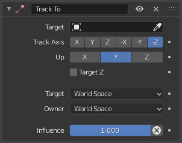
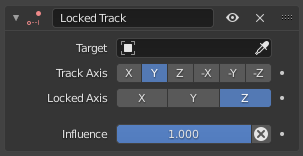
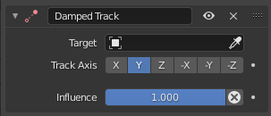
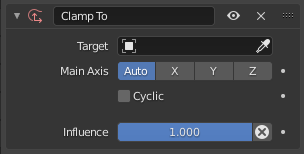

# 03-Tracking Constraints 跟踪约束

Tracking 约束，将约束对象和目标对象绑定在一起，是通过一些特殊算法，实现约束对象到目标对象的特定跟踪需求

## 1. Track To Constraint 标准跟踪约束

加上 Track To 约束的对象，会通过一个设定的自身轴方向，始终指向目标对象。

通过此约束，可以很方便的让一个对象始终面向另一个对象，不论他们之间的位置如何改动

- Target Axis：指定加约束的对象，自身通过哪个 Local 轴指向目标对象

- Up ：指定加了约束的对象，自身朝上的轴

- Target Z：使用目标的 Local 坐标 Z 轴，而非世界坐标

## 2. Locked Track Constraint 锁定跟踪约束

它是标准跟踪约束(Track To constraint)的基础上多了一个锁定轴，即只能围绕锁定轴旋转。

因此，其自身只可以通过绕此轴旋转跟踪它的目标，除非目标是在垂直于锁定的轴平面，并和自身相交，否则这个自身不能真正指向它的目标。

- Locked Axis: 只能在指定的锁定轴上旋转

## 3. Stretch To Constraint 拉伸至约束

拉伸至 约束使其自身朝向其目标旋转和缩放其 Y 轴。

它也可以选择一些原始的体积特征，因此所以当目标越靠近时，自身就越受到挤压，当目标远离时，越厚。但请注意，它不是自身因此被保存的实际体积，而是虚拟的定义其缩放值。因此，这个功能甚至工作于非体积的对象，如空物体，二维网格或表面，和曲线。

- Original Length:初始长度  
  该数字按钮值为约束对象与其约束目标之间的剩余距离，即约束对象没有变形(拉伸)的距离

- Volume Variation 体积变化  
  这个数字按钮控制 "体积(volume)" 的变化与拉伸量成指数关系。请注意，数值不允许为零，如果你想禁用体积功能，使用 None 无 按钮(见下文)。

- Volume Min, Max  
  限制体积维持到最小和最大缩放由每个 Bulge 膨胀 因子。

- 维持体积  
  这些按钮控制沿 Y 轴拉伸时的 x 和/或 Z 轴应受到的影响(放大/缩小)，以保持虚拟的体积。如果启用 none(无) 按钮，则禁用体积功能。

- 旋转
  指定如何旋转所有者以使用其 Y 轴跟踪目标。

      * XZ, ZX
      这些按钮相当于 向上 的标准跟随约束( Track To constraint ): 其所有者以指定顺序绕两个局部轴向旋转。

      * Swing 摇摆
      约束使用单个 摇摆 旋转，等同于 阻尼跟踪约束。

## 4. Damped Track Constraint 阻尼跟踪约束

约束 自身的一个本地(局部)轴总是指向 目标。

和基本跟踪约束非常类似，除了没有 up 选项外。

## 5. Clamp To Constraint 轴向限定约束

轴向限定(Clamp To) 约束将一个对象限定到曲线上。

- Main Axis 主轴 :

  这个按钮组控制那一个全局轴(x，y 或 z)是路径的主要方向。当将物体限定到目标曲线上时，它不会在这个轴上显著移动。由于该约束功能的不精确性，它可能会在该轴上产生少量移动。

  例如，如果你是火箭发射动画，它将是 Z 轴，因为发射路径的主要方向是向上的。默认 Auto(自动) 选项选择的轴曲线是最长的。这通常是最好的选择。

> 参考资料：
> [跟踪约束官方文档](https://docs.blender.org/manual/zh-hans/3.0/animation/constraints/index.html#tracking)
