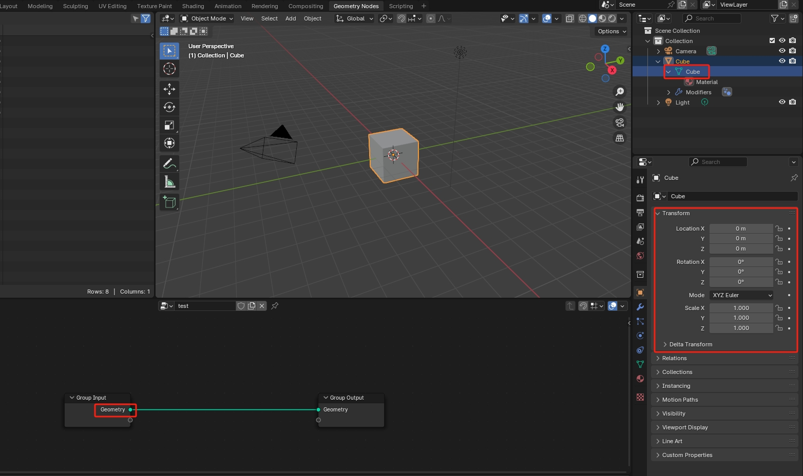
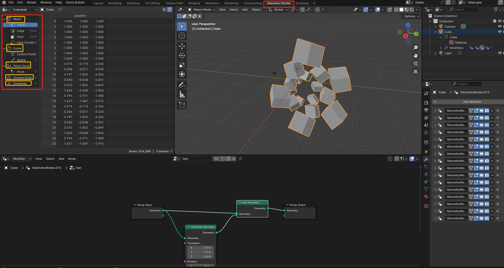

# Geometry Node 简介

## 1. 概念

### 1.1 基础概念

#### 什么是 Blender 中的 Geometry ???

Geometry Nodes 所操作的数据，输入和输出，都是 **Geometry**

在 Blender 中，"Geometry"（几何体）是一个广泛的术语，用来描述 3D 模型或场景中构建物体形状的基本结构。

**几何体 - Gemetry** 是通过顶点（vertices）、边（edges）和面（faces）来定义的。

这些元素共同定义了模型的外观和空间占用

其核心数据就是模型所包含的 点、线、面 各元素的 **Transform** 数据

#### Geometry Node 概念

Geometry Nodes is a system for modifying the geometry of an object with node-based operations. It can be accessed by adding a Geometry Nodes Modifier.

几何节点（Geometry Nodes）是一个通过基于节点的操作来修改对象几何形状的系统。可以通过添加几何节点修改器来访问该系统。

上面的概念来自[官方文档](https://docs.blender.org/manual/zh-hans/4.1/modeling/geometry_nodes/introduction.html)

我这里给出的结论：

* **Geometry Node** 本身就是 **Modifier** ，而且是 **建模** 用的 **Modifier**
* **Geometry Node** 是针对 模型中 **几何数据（Geometry）** 的 **可视化编程语言** 

### 1.2 功能范围

几何节点可以修改不同类型的几何体：

* 网格 Meshs
* 曲线 Curves
* 点云 Point Clouds
* 体积 Volumes
* 实例 Instances

### 1.3 核心要点

几何节点模组，核心要点：

* 几何节点模组和别的模组一样，会序列化到硬盘，称为一种特殊的资源文件，一经创建，可以多次使用；同一个几何节点模组，可以加载到多个模型上。
* 同一个模型，同时可以添加多个几何节点模组，形成一个链装结构，前一个模组的输出，作为下一个模组的输入。
* 正如上一个要点，模块化的几何节点模组，可以将复杂逻辑进行拆分，增强几何节点模组的重用性。可以比对普通编程语言中的函数概念 ，函数可以拆分，函数可以重用。
