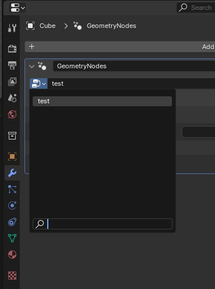
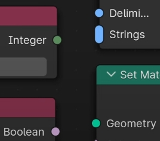
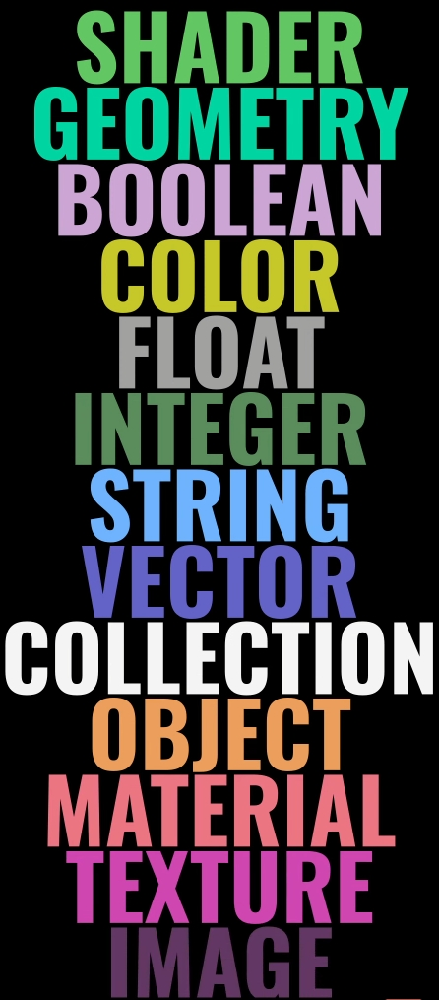
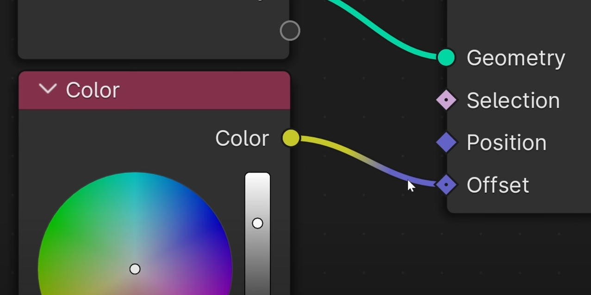
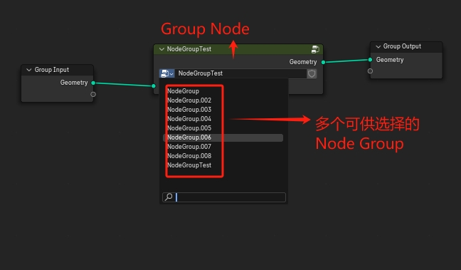
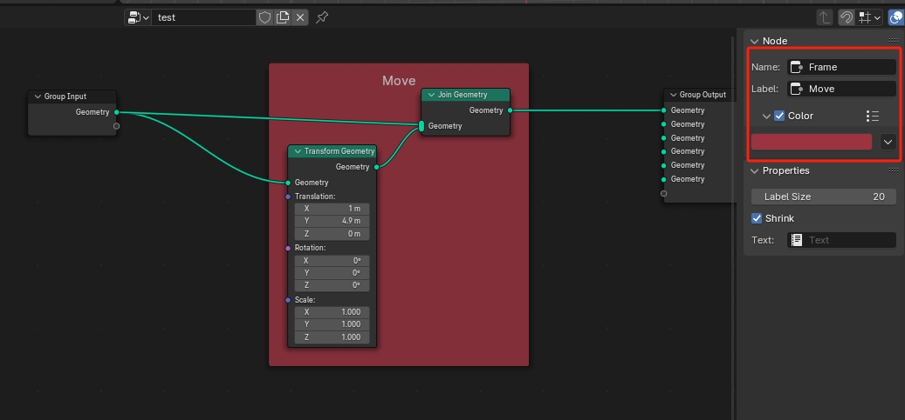

# 第二章 Geometry Node 核心概念

## 1. Modifier

上一节说过，Geometry Node Moddifier 本体就是修改器。具备修改器的所有特性，当然，操作方式也是一样。

因为输入输出类型相同，都是Geometry，所以，Geometry Node Modifier 可以级联，上一个 Geometry Node Modifier 的输出，可以作为下一个 Geometry Node Modifier 的输入。

Geometry Node Moddifier 只是 Node Tree 的插槽， 真正的修改，是在 Node Tree 中实现的。

## 2. Node Tree

每次新建一个 Geometry Node Modifier 后，需要新建一个 Node Tree，我们实际编辑的就是 Node Tree 。
 
Node Tree 能够序列化到硬盘中，一次创建，多次使用，甚至是跨项目使用

Geometry Node Moddifier 就是 Node Tree 的容器，在其中，可以选择使用不同的  Node Tree 。

可以选择当前项目中的所有 Node Tree ，也可以选择导入其他项目的 Node Tree

在 Geometry Node Editor 中，可以进行 Node Tree 的选择、切换；

也可以在属性窗口的 Modifier 分页中，进行 Node Tree 的选择、切换。

## 3. Node

这个概念没啥好说的，就是 Geometry Node Moddifier 编辑器中的一个圆角矩形，代表一个功能块。

类似于函数，是个可视化的程序块，可以进行输入输出，并且可以进行连接。

下图包含了 blender 3.5 中的所有 Geometry Node Moddifier 节点：

来源：https://www.reddit.com/r/blender/comments/13t6fkm/i_organized_all_462_geometry_nodes_in_blender_35/

## 4. Socket Type

每个节点上，都会有多个输入或输出插口 —— Socket。

仔细观察的话，会发现这些 Socket 有很多不同的外观，不同的形状、颜色。

特定的形状和颜色，代表着特定的类型和用途。

两种分类：

* value ：  
  各色实心圆点  ， 特殊一些的就是可以接收多个 value 的胶囊型插口，单也是 value 类型；
  
* field ：
  正菱形，分为两种：中间有个黑点的，代表数据已经固定不变；不加点的，代表数据可变
    
  请注意： Field 插口,中间是否有黑点，是可变的，如果接入的是固定值，就有黑点；如果接入数据变换为可变值，黑点就消失

### 4.1 Values 值

Value 插口表示固定的数值或数据。这种插口传递的是单一的、明确的数值（如整数、浮点数、向量等），而不是根据几何体属性动态计算的数据。

**13 种** 数据类型，分别用不同颜色的实心圆点在 Node 上显示：

常见用途：

设置具体的参数值，比如位移的距离、旋转的角度、缩放的比例等。

实例：

在 Transform 节点中，位置、旋转和缩放的输入端口都是 Value 类型，因为它们需要固定的数值来定义变换参数。

### 4.2 Fields 场

> blender 4.1 官方文档概念：
> en: 
> Fundamentally, a field is a function: a set of instructions that can transform an arbitrary number of inputs into a single output. A field's result can then be calculated many times with different input data. They are used all over geometry nodes to allow calculations that have different results for every element (mesh vertices, faces, etc.).
> ch:
> 从根本上来说，场是一个函数：一组可以将任意数量的输入转换为单个输出的指令。然后可以使用不同的输入数据多次计算字段的结果。它们用于所有几何节点，以允许对每个元素（网格顶点、面等）产生不同结果的计算。

Field 插口表示动态计算的数据字段。这种插口传递的是根据几何体属性进行计算的结果。

Field 类似与 函数，可以根据参数进行计算，返回值；参数变化时，值也会跟着变化。

Field 中包含数据的数量在不共同情况下不同。比如 Position 节点的输出接口 Position，表示几何体中每个点的位置，当前操作的几何体模型不同，Position 接口中的数据数量自然也不同。

例如，顶点的位置、法线方向或颜色可以通过字段动态计算。

常见用途：

用于动态计算每个点、边或面的属性值。
例如，通过字段来控制顶点的颜色或变换参数。

实例：

Position 节点输出的是一个字段，表示几何体中每个点的位置。
Normal 节点输出的是一个字段，表示几何体表面的法线方向。

## 5 Attributes 特性（属性）

### 5.1 概念

Attributes 特指几何体上各项基本几何数据(如：点、线、面、面拐等)所**附加的**数值信息，这些 Attributes 特性（属性）是对几何体的附加说明，比如顶点颜色、UV 坐标、发现、权重 等等。

如果将几何体上的基本数据称为**几何元数据**，那么 Geometry Node Modifier 中的 Attributes 就是几何元数据的附加说明，**几何体元数据的附加数据**。

有些类似 C# 中的 特性 Attributes 。

只不过 C# 中的特性功能更强，它除了可以附加到数据上，还可以附加到其他各种语法结构上（程序集、类型、方法、属性等），而Geometry Node Modifier 中的 Attributes 则是只能附加到几何体各种元数据上；
C# 中的特性除了可以添加数据信息，还可以添加方法来执行特定的功能，而Geometry Node Modifier 中的 Attributes 则是只能用来**扩充数据信息**。

常见用途：

* 读取几何体的现有属性或将计算结果写入几何体的属性中。
* 用于复杂几何体数据操作和自定义属性管理。
* 作为参数传递。

### 5.2 Attribute 特性分类

* 命名 Attribute（Named Attributes）：
  
  这些是用户定义的属性，可以通过名称在节点树中访问和修改。
* 匿名 Attribute（Anonymous Attributes）：
  
  这些属性没有名称，只在特定的节点之间传递，不在几何数据结构中存储。
* 内置 Attribute（Built-in Attributes）：
  
  这些是 Blender 预定义的属性，如顶点位置、法线、颜色等。

### 5.3 Attribute 常用操作

#### 添加（创建）Attributes：

* 使用节点创建：Store Named Attribute节点是最直接的方式，它允许你创建一个新的命名属性，并指定其类型、初始值和作用域。
* 自动创建：某些操作（如Add Modifier或特定的修改器）可能会自动创建属性，如rest_position在使用Subdivision Surface前自动添加。
* 通过运算创建：在进行数学运算或向量运算后，直接将结果连接到需要属性输入的节点（如Set Position），自动创建匿名属性。

#### 使用（读取/写入）Attributes：

##### 读取属性：

* 属性字段：在需要属性输入的节点上，点击属性字段旁边的图标，从弹出菜单中选择已有属性或手动输入属性名称。
* 搜索功能：在某些界面中，如修改器面板，可使用搜索功能查找并选择属性。

##### 写入属性：

* 节点连接：将一个节点的输出连接到另一个节点的属性输入端口，如从Vector Math节点连接到Set Position节点。
* 修改属性值：通过修改器或特定节点（如Math节点）直接修改属性的值。

### 5.4 匿名与命名Attributes的区别：

#### 匿名Attributes

* 通常由节点内部计算产生，并通过节点输出的Attribute Field供其他节点使用。它们没有固定名称，但在使用过程中如同命名Attributes一样灵活。
* 只能在当前节点树中使用
* 局部性：匿名属性仅在当前节点树内存在，不能在不同的节点树之间传递。
* 临时性：这些属性通常用于临时计算和中间数据传输，不会被保存到几何数据中。

#### 命名（Named）Attributes

* 可以明确指定和引用，便于在多个节点间共享和修改。在创建时需指定名称，便于后续操作中直接引用。
* 可在节点树外部使用，甚至不一定是 Geometry Node Modifier。
  例如：可以将 节点树中的 Attributes ，在 Shader Node 中使用

## 6. Link

Link 是节点之间的连接线，连接线可以连接不同节点的输出和输入。

概念很简单，但连接不同 Socket 的 Link ，也有着不同的外观，方便识别连接关系。

线的表现形式也有很多种，通过观察就能知道其意义，方便理解

* 连接同类型 socket ，显示为 socket 相同颜色，选中任意连接的节点，线会同时高亮显示：  
    
  
* 连接不匹配的 socket ，显示为红色，代表连接 **不生效**：
    
* 连接不同类型但相互匹配的 socket ，显示为**渐变色**：
  
* 点划线连接的含义
  
  * 字段传递：如前所述，点划线主要表示传递的是字段而不是具体的数值。字段是动态计算的表达式，在几何数据上应用规则，而不是静态的具体值。

  * 不兼容性或限制：在某些情况下，点划线也用来表示两个插槽之间的连接存在某种限制或不兼容性。具体来说：

    * 数据类型不匹配：当连接的两个插槽类型不完全匹配时，可能会显示点划线。例如，试图将一个字段连接到一个期望具体值的插槽。
    * 需要进一步设置：某些节点可能需要额外的设置或条件才能正常工作。如果连接时没有满足这些条件，点划线可以提醒用户需要进行调整。
      
## 7. Frame

## 8. Node Group 和 Group Node

### Node Group 概念

Group 其实就是 Node Group ，指的就是一组节点的集合。 

NodeGroup 可以序列化到硬盘上，一次创建，多次使用

### Group Node

组节点将一组节点组合成一个节点，并有选择地公开这些节点的输入和输出。

组节点可以通过隐藏复杂性和重用功能来简化节点树。

在 Group Node 上，可以选择使用哪个 Node Group

### 相互关系 

3D 模型 > Geometry Node Modifier > Node Tree > Node Group

自左到右，是包含关系，左侧包含右侧

### 操作
* 创建：选中节点后，ctrl + g 创建新Group；
* 编辑：选中 NodeGroup 节点后，tab 键进入编辑
* 退出：在 编辑 group 窗口中，右键激活快捷菜单，exit group 退出编辑并返回上层

### Group 和 Frame 区别

* Frame 只是一个用来增强显示用的，节点分组的可视化容器。只用作在当前这一层中，显示节点的分组，可以进行缩放、移动等操作。可以添加 Lable、更改背景颜色。
  
* 而 Group 则是真正意义上的节点组，可以进行分组操作，并且可以保存为模板。

