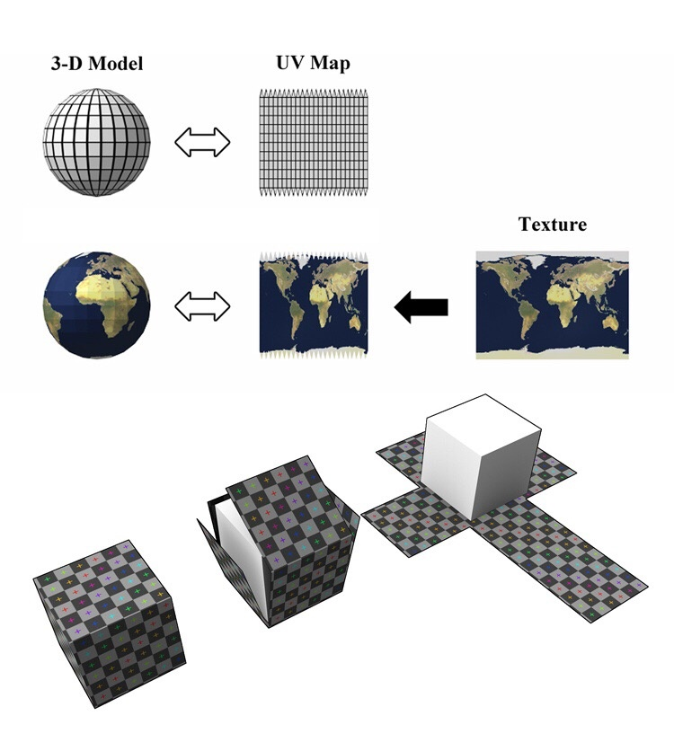

# Texture 纹理

## 1. 概念

- 纹理：  
   纹理是贴在 Mesh 表面的那一层皮，可以是静态图片 image（位图），也可以是由算法生成的 Patten （图案、花样）

- UV 贴图：  
   “UV”是纹理贴图坐标的简称。 它定义了图片上每个点的位置的信息。 这些点与 3D 模型是相互联系的，以决定表面纹理贴图的位置。 就好像平面的布料，剪裁制作成立体的衣服一样。  
   UV 贴图就是将纹理二维坐标映射（Map）到 3D 网格上的过程。

## 2. Blender UV Editor

UV 编辑器用于将图像/纹理等二维素材映射到三维物体，并编辑所谓的 UV

UV 映射是把二维贴图映射到三维物体最灵活的方法。在此过程中，将三维 (X, Y & Z) 网格展开为二维 (X & Y ... 或者也叫做, "U & V") 图像。图像中的色彩就这样映射到网格上，显示为网格表面的色彩。使用 UV 贴图可以做出程序化材质和贴图无法做到的真实感，可以做出比顶点绘制更好的细节。
