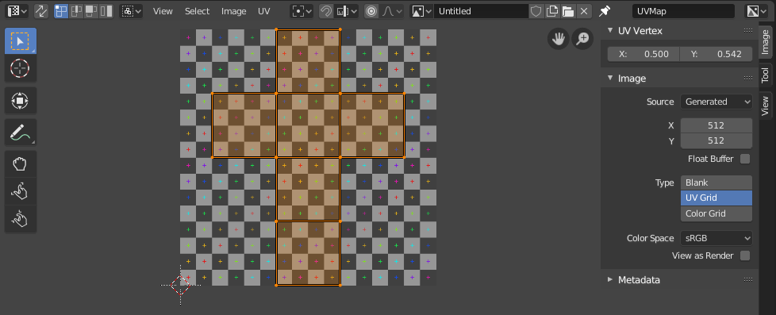
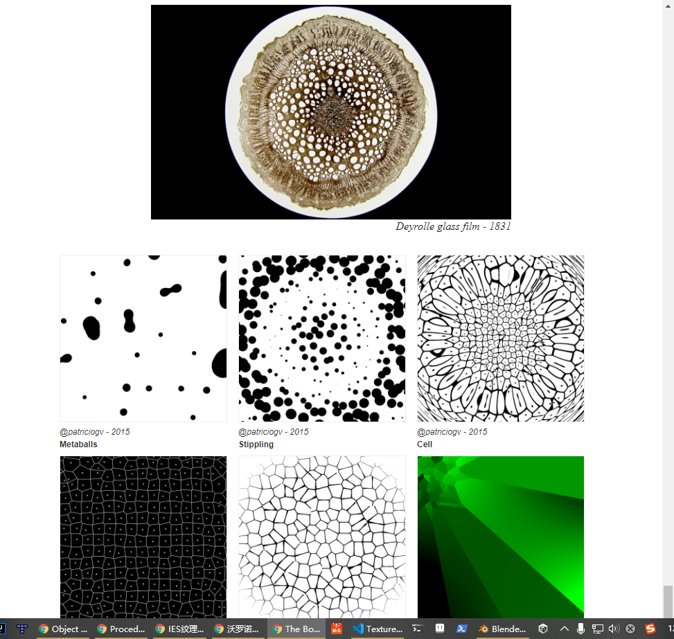

# Texture 纹理

## 1. 概念

- 纹理：  
   纹理是贴在 Mesh 表面的那一层皮，可以是静态图片 image（位图），也可以是由算法生成的 Patten （图案、花样）

- UV 贴图：  
   “UV”是纹理贴图坐标的简称。 它定义了图片上每个点的位置的信息。 这些点与 3D 模型是相互联系的，以决定表面纹理贴图的位置。 就好像平面的布料，剪裁制作成立体的衣服一样。  
   UV 贴图就是将纹理二维坐标映射（Map）到 3D 网格上的过程。

## 2. Blender UV Editor

UV 编辑器用于将图像/纹理等二维素材映射到三维物体，并编辑所谓的 UV

UV 映射是把二维贴图映射到三维物体最灵活的方法。在此过程中，将三维 (X, Y & Z) 网格展开为二维 (X & Y ... 或者也叫做, "U & V") 图像。图像中的色彩就这样映射到网格上，显示为网格表面的色彩。使用 UV 贴图可以做出程序化材质和贴图无法做到的真实感，可以做出比顶点绘制更好的细节。

## 3. 纹理 Shader Node

[blender 纹理 Node 文档](https://docs.blender.org/manual/zh-hans/3.0/render/shader_nodes/textures/image.html)

分为两大类，一类使用静态图像作为纹理素材，另一类使用算法生成的图案作为纹理素材

### 3.1 使用静态图像素材的纹理节点

使用图片、照片等位图作为纹理节点的素材，有三个:

- Environment Texture : 环境纹理节点
- IES Texture：用于匹配基于 IES 文件(IES)的现实世界的灯光。IES 文件存储光源的方向强度分布。
- Image Texture ：图像纹理节点

### 3.2 使用算法生成的图案素材的纹理节点

除了上面的三个之外的所有纹理节点

他们是通过算法生成的 Procedurally generated Patten（生成图案） 作为纹理它们的特点占用资源较少，且无论如何放大，都不会失真（类似于矢量图）

沃罗诺伊纹理着色器节点：  
在输入纹理坐标处使用 Worley Noise（沃利噪声） 函数算法。Worley 噪声接近于模拟石头、水或生物细胞的纹理。

[Worley Noise 扩展阅读](https://thebookofshaders.com/12/?lan=ch)
